# 03. Arquitectura de referencia

> Documento derivado del dossier maestro de Pliegue. Mantener ambos sincronizados cuando cambien decisiones de producto.

## 7. Flujo de IA e indexación

```mermaid
flowchart LR
    A["Drive, carpeta local o archivo"] --> B["Inventario y control de permisos"]
    B --> C["Cola de trabajos idempotente"]
    C --> D["Lectura local, descarga o exportación temporal"]
    D --> E["Parser, OCR o transcripción"]
    E --> F["Documento normalizado con anclas"]
    F --> G["Metadatos y clasificación"]
    F --> H["Fragmentos y embeddings"]
    G --> I["Postgres + búsqueda léxica"]
    H --> I
    I --> J["Filtro por Área, alcance y permisos"]
    J --> K["Recuperación híbrida y reranking"]
    K --> L["Respuesta con citas navegables"]
```



### Pipeline recomendado

1. Registrar metadatos y versión del archivo.
2. Exportar los archivos de Google Workspace al formato de procesamiento apropiado.
3. Pasar el contenido por un parser aislado con límites de tamaño, tiempo y memoria.
4. Aplicar OCR o transcripción solo cuando haga falta.
5. Normalizar títulos, párrafos, tablas, imágenes y coordenadas.
6. Detectar idioma, tipo documental, entidades, sensibilidad y posible duplicado.
7. Dividir por estructura semántica, no solo por cantidad fija de caracteres.
8. Guardar texto para búsqueda completa y embeddings para similitud.
9. Recuperar con búsqueda híbrida, filtrar por permisos y reranquear.
10. Generar una respuesta cuyo mapa de citas se valide antes de mostrarla.

### Reglas de confianza

- Ningún fragmento puede llegar a la IA si el usuario perdió acceso al archivo.
- El `workspace_id`, las fuentes incluidas y los permisos se filtran antes y después de la recuperación.
- Un alcance Drive/local separado se aplica dentro de la consulta léxica y vectorial, no solo al presentar la respuesta.
- Un documento puede contener instrucciones maliciosas; su texto siempre se trata como datos, nunca como instrucciones del sistema.
- Las respuestas distinguen texto de la fuente, inferencia y sugerencia creativa.
- La clasificación automática muestra confianza alta, media o baja; la baja requiere confirmación.
- Las salidas estructuradas se validan con esquemas antes de persistirse.
- Los proveedores de catálogo y ofertas reciben consultas bibliográficas, nunca fragmentos del índice privado.

## 8. Fuentes: Google Drive y archivos locales

### 8.1 Google Drive

#### Flujo de autorización

1. Iniciar sesión en Pliegue.
2. Explicar con lenguaje simple qué se leerá y qué no se modificará.
3. Abrir Google Picker.
4. Elegir carpeta o archivos.
5. Mostrar estimación de cantidad, formatos y tiempo antes de iniciar.
6. Indexar en segundo plano y permitir empezar con los primeros documentos listos.

#### Decisión crítica de OAuth

Google recomienda combinar Picker con `drive.file` por seguridad y mejor experiencia. Ese alcance concede acceso por archivo. La hipótesis de acceso recursivo a todos los descendientes de una carpeta existente debe comprobarse en un **spike técnico con cuentas personales y Shared Drives** antes de cerrar la arquitectura.

Si el producto necesita leer permanentemente una carpeta arbitraria completa y `drive.file` no cubre sus descendientes, podría requerir `drive.readonly`, que Google clasifica como alcance restringido. Una aplicación pública que almacene o transmita esos datos puede necesitar verificación y evaluación de seguridad. Por eso el MVP no debe pedir permisos de escritura y el calendario debe reservar este trámite desde el inicio.

#### Sincronización

- Guardar cursor de cambios por usuario y, cuando aplique, por Shared Drive.
- Recibir notificaciones mediante webhook y consultar el registro de cambios.
- Comparar versión conocida con estado actual; una notificación no contiene necesariamente el delta completo.
- Renovar canales antes de expirar.
- Tratar pérdida de acceso y eliminación como estados distintos cuando sea posible.
- Reindexar solo el archivo afectado y mantener trabajos idempotentes.

### 8.2 Archivos locales

Los archivos locales usan el mismo modelo documental, parsers, categorías, lector, anotaciones y citas que Drive. La diferencia está en cómo cada plataforma concede y conserva el acceso.

| Plataforma | Selección | Comportamiento recomendado |
|---|---|---|
| Windows | selector nativo de archivo o carpeta | lectura recursiva limitada a la raíz elegida, vigilancia de cambios y opción de índice totalmente local |
| macOS | selector nativo + bookmark de seguridad | acceso persistente limitado a lo elegido, watcher, sandbox/entitlements y opción de índice totalmente local |
| Web | File System Access API cuando esté disponible | permiso explícito para archivo/carpeta; al volver puede requerir autorización; fallback mediante selector, arrastrar y soltar o importación |
| Android/iOS | selector de documentos, menú Compartir y cámara | acceso solo a elementos elegidos por el usuario; copia temporal o a la bóveda privada de la app cuando el sistema lo requiera |

#### Estados de una fuente local

- `available`: carpeta montada y permiso vigente.
- `indexing`: inventario o extracción en curso.
- `ready`: índice actualizado.
- `detached`: disco externo, unidad de red o carpeta no disponible.
- `permission_required`: el sistema operativo o navegador exige volver a autorizar.
- `moved`: la raíz cambió de ubicación y requiere confirmación.

La biblioteca conserva el título, las categorías, las notas y el último estado cuando una unidad está desconectada. El contenido no debe usarse para una nueva respuesta de IA si el usuario eligió no conservar texto derivado o si la política de la fuente exige disponibilidad en vivo.

#### Seguridad local

- Pedir lectura, nunca acceso global al disco.
- Limitar el alcance a la carpeta elegida y sus descendientes autorizados.
- No seguir enlaces simbólicos que salgan de la raíz permitida.
- No ejecutar macros, scripts, binarios ni contenido activo.
- Aplicar límites contra archivos comprimidos maliciosos, rutas circulares y archivos excesivos.
- Guardar una referencia opaca a la ruta; no exponer rutas privadas en analítica, logs o tarjetas compartidas.
- Detectar cambios con watcher en Windows/macOS y reconciliar periódicamente el inventario por si se pierde un evento.
- En macOS sandboxed, crear y renovar bookmarks de seguridad solo para las raíces elegidas, liberar el recurso al terminar y mostrar una acción clara si el permiso queda obsoleto.

#### Tres modos de incorporación

1. **Abrir:** lectura puntual; no queda en la biblioteca al cerrar salvo que el usuario lo guarde.
2. **Vincular:** Pliegue conserva permiso y sincroniza los cambios mientras la fuente esté disponible.
3. **Importar:** crea una copia privada administrada por Pliegue para disponer del documento entre dispositivos.

La decisión UX queda cerrada con un **predeterminado contextual**:

- Carpeta en Windows/macOS o navegador compatible: **Vincular**, porque evita duplicados y conserva la fuente como autoridad.
- Archivo individual en móvil o navegador sin permiso persistente: **Importar**, porque garantiza que reaparezca.
- **Abrir una vez** permanece como acción secundaria para revisar algo sin agregarlo.

Antes de indexar se muestra una hoja breve con Fuente original, Qué conservará Pliegue, Dónde se procesará y Cómo retirarlo. El usuario confirma el modo, pero no debe elegir entre tres conceptos técnicos en cada apertura.

## 9. Arquitectura técnica recomendada

### Enfoque

Un monorepo TypeScript con experiencias específicas por plataforma y contratos compartidos. Compartir dominio, tokens, iconos y API; no forzar el 100 % del código visual entre web y móvil.

```text
pliegue/
├── apps/
│   ├── web/              # Next.js App Router
│   ├── mobile/           # Expo + React Native, Android/iOS
│   └── desktop/          # Tauri para Windows y macOS
├── packages/
│   ├── domain/           # entidades, casos de uso y permisos
│   ├── api-client/       # cliente tipado
│   ├── design-tokens/    # color, tipografía, espacio y movimiento
│   ├── ui-web/           # componentes web accesibles
│   ├── ui-native/        # componentes nativos equivalentes
│   ├── reader-core/      # anclas, progreso y anotaciones
│   └── schemas/          # contratos de validación
├── services/
│   ├── control-plane/    # conexiones, biblioteca, notas y shares
│   ├── indexer/          # inventario, exportación y sincronización
│   └── document-workers/ # parsing, OCR, transcripción e IA
└── infrastructure/
    ├── database/
    ├── queues/
    └── observability/
```

### Stack sugerido

| Capa | Elección | Motivo |
|---|---|---|
| Web | Next.js App Router + TypeScript | panel y lector web, rutas compartibles, buen modelo servidor/cliente |
| Móvil | Expo + React Native con development builds | Android/iOS, cámara, share sheet, archivos y notificaciones nativas |
| Escritorio | Tauri para Windows/macOS | selector nativo, lectura local con alcance limitado, vigilancia recursiva e instaladores sin duplicar toda la UI |
| Datos | PostgreSQL/Supabase + RLS | modelo relacional, autenticación y control por usuario/equipo |
| Búsqueda | texto completo + pgvector | recuperación híbrida en una primera etapa |
| Trabajos | cola durable + workers aislados | indexación larga, reintentos e idempotencia |
| Archivos derivados | almacenamiento de objetos cifrado | miniaturas, OCR y exportaciones temporales |
| Observabilidad | logs estructurados, métricas y trazas | depurar cada etapa de un documento |

Tauri también soporta móvil, pero se recomienda Expo para Android/iOS porque el producto necesita cámara, compartir, gestos, descarga y lectura móvil de alta calidad. Tauri queda enfocado en Windows y macOS.

### Matriz de entrega por plataforma

| Plataforma | Paquete | Archivos locales | Integración destacada |
|---|---|---|---|
| Web | PWA/web responsive | abrir, importar y vincular cuando el navegador lo permita | Drive, enlaces compartibles y administración |
| Windows | instalador Tauri firmado | carpetas persistentes, watcher y bóveda local | share target, protocolo propio y funcionamiento offline |
| macOS | DMG y, después, Mac App Store | carpeta persistente mediante sandbox/bookmarks | firma, notarización, entitlements y share extension posterior |
| Android | Expo/React Native | Storage Access Framework, compartir e importar | cámara, notificaciones y lectura offline |
| iOS/iPadOS | Expo/React Native | document picker y copias administradas | cámara, share sheet, archivos y lectura offline |

### Modos de privacidad

1. **Nube privada:** el servidor procesa y guarda texto derivado y embeddings cifrados. Es la opción más consistente para web y sincronización entre dispositivos.
2. **Vinculado al dispositivo:** el archivo original permanece local; Pliegue guarda derivados cifrados para búsqueda y continuidad entre dispositivos, solo con consentimiento.
3. **Bóveda local:** la app de Windows/macOS mantiene contenido, índice y, progresivamente, modelos locales. Puede sincronizar únicamente metadatos o notas elegidas. El MVP web admite archivos locales, pero el modo completamente local se entrega con la app de escritorio.

### Región, identidad y recuperación

- Región primaria de base de datos y objetos: **São Paulo (`sa-east-1`)**, cercana al mercado inicial peruano. Metadatos y derivados de un Área se mantienen en la misma región cuando el proveedor lo permita.
- Los proveedores externos de IA se tratan como subencargados independientes; región y retención se muestran por ruta. Un requisito de residencia incompatible desactiva esa ruta en lugar de degradarla silenciosamente.
- Web con Drive/sincronización: cuenta obligatoria mediante Google o enlace mágico por correo. Escritorio: **modo local sin cuenta** disponible desde el inicio.
- La bóveda local se cifra con una clave guardada en el almacén seguro del sistema. Al activar sincronización cifrada se genera un código de recuperación; sin ese código ni un dispositivo autorizado, Pliegue no promete recuperar el contenido cifrado.
- Una biblioteca local puede convertirse en cuenta conservando identificadores y notas, sin duplicar originales.

### Derivados, desconexión y borrado

- Si una unidad queda temporalmente `detached`, se conservan metadatos, notas, favoritos, progreso, miniaturas y el índice local cifrado. No se generan respuestas nuevas desde contenido inaccesible; las respuestas previas se muestran como históricas.
- El original vinculado nunca se copia a nube sin activar **Sincronizar contenido**. En modo importado, Pliegue administra una copia cifrada.
- **Quitar vínculo** conserva notas/progreso y elimina el permiso. **Eliminar de Pliegue** retira original importado y derivados del sistema activo en 24 horas, del índice/colas en 7 días y de backups rotativos en un máximo de 35 días.
- El usuario recibe un comprobante de borrado con categorías afectadas y fecha máxima de purga. Los eventos mínimos de auditoría se conservan sin texto documental cuando la ley lo exija.
