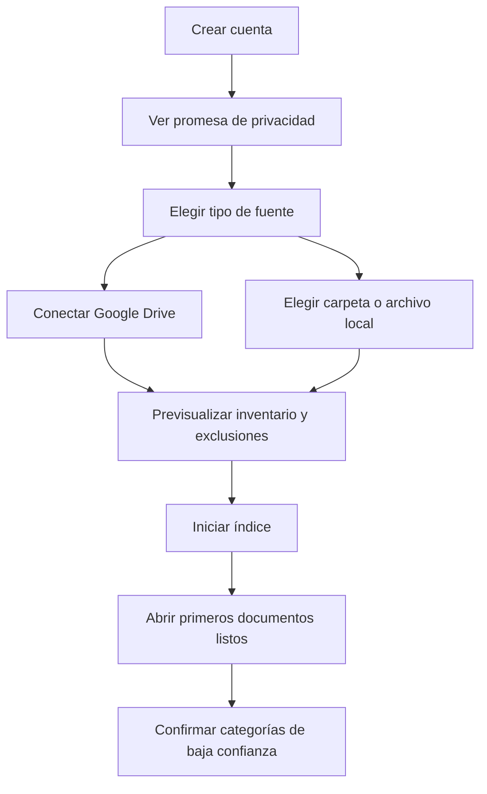

# 06. Flujos de usuario

> Documento derivado del dossier maestro de Pliegue. Mantener ambos sincronizados cuando cambien decisiones de producto.

## 5. Arquitectura de información

### Navegación de escritorio y web

1. **Hoy:** pendientes, archivos nuevos, reanudaciones y sugerencias.
2. **Áreas de trabajo:** cambia el límite activo y muestra sus fuentes.
3. **Biblioteca:** documentos, favoritos y vistas guardadas.
4. **Descubrir:** recomendaciones, libros externos, ofertas y alertas.
5. **Preguntar:** búsqueda y conversación con alcance explícito.
6. **Notas:** anotaciones, fichas, capturas y compartidos.
7. **Fuentes:** Drive, carpetas locales, archivos importados, trabajos, errores y consumo.
8. **Ajustes:** lectura, traducción, IA, privacidad, idioma y facturación.

### Navegación móvil

Barra inferior de cinco destinos: **Hoy, Biblioteca, Preguntar, Descubrir, Perfil**. La cámara aparece como acción contextual en Biblioteca y el lector. El selector de Área de trabajo y alcance permanece accesible desde el encabezado.

### Pantalla principal

- Encabezado: Área de trabajo, selector de alcance, búsqueda/comando y estado de fuentes.
- Bloque “Continúa leyendo”.
- Estante “Llegaron a tus fuentes”.
- Estante “Favoritos”.
- Estante “Para ti”, separado entre elementos propios y libros externos.
- Espacios inteligentes con explicación de cambios.
- Cola de clasificación que requiere confirmación.
- Resumen semanal: tiempo leído, documentos terminados y notas creadas.

### Lector de escritorio

Distribución adaptable de cuatro zonas:

| Zona | Ancho sugerido | Contenido |
|---|---:|---|
| Rail | 72 px | navegación global |
| Contexto | 280–320 px | índice, miniaturas, notas |
| Lectura | flexible | página original o texto fluido |
| Copiloto | 340–400 px | La Lente, chat y fuentes |

El panel de copiloto está cerrado por defecto para maximizar la concentración. En tableta se convierte en panel deslizante; en móvil, en hoja inferior.

En el lector, la barra superior agrupa Favorito, alcance de IA, idioma y modo Original/Bilingüe/Traducido. El control de traducción no compite visualmente con las herramientas de anotación.

## 13. Flujos críticos

### A. Primera conexión

### B. Leer y comprender

1. Abrir desde Hoy o Biblioteca.
2. Reanudar en la última posición.
3. Seleccionar un fragmento.
4. Abrir La Lente y elegir “Explicar”.
5. Ver explicación y fuentes relacionadas.
6. Convertir el resultado en nota sin perder la selección original.

### C. Crear una captura social

1. Seleccionar texto o región.
2. Elegir “Crear captura”.
3. Aplicar plantilla, proporción y comentario.
4. Revisar fuente, privacidad y texto alternativo.
5. Compartir mediante el sistema operativo o guardar imagen.

### D. Corregir la IA

1. Abrir el detalle de una categoría sugerida.
2. Ver evidencia y confianza.
3. Confirmar, reemplazar o excluir.
4. Aplicar la corrección solo al documento o como preferencia futura.

### E. Preguntar cruzando nube y local

1. Entrar a un Área de trabajo que contenga Drive y una carpeta local.
2. Abrir `ScopeSelector` y elegir Todo, Drive, local o fuentes concretas.
3. Revisar el aviso de procesamiento si contenido local saldrá del dispositivo.
4. Formular la pregunta.
5. Recibir una respuesta cuyas citas distinguen origen, archivo y ubicación.
6. Cambiar el alcance y comparar el resultado sin perder la conversación.

### F. Traducir respetando la composición

1. Elegir selección, bloque, vista, página, rango, capítulo o documento.
2. Seleccionar idioma, glosario y modo Bilingüe/Traducido.
3. Mostrar proveedor/modelo, estimación de tamaño/costo y advertir limitaciones del formato.
4. Procesar bloques, tablas, pies de imagen y OCR sin alterar el original.
5. Revisar cifras, nombres y regiones marcadas con baja confianza.
6. Guardar la traducción como capa derivada o exportar si la licencia lo permite.

### G. Descubrir y seguir una oferta

1. Configurar gustos de forma explícita o autorizar señales de la biblioteca.
2. Ver por separado “Ya lo tienes” y “Fuera de tu biblioteca”.
3. Abrir “¿Por qué?” para entender la recomendación.
4. Buscar en catálogos conectados o activar Búsqueda libre para físico, digital, audio, nuevo o usado.
5. Comparar ofertas de la misma edición, formato, condición y país; confirmar hallazgos web en la tienda.
6. Marcar Favorito, Quiero leer o crear una alerta de precio.

### H. Retomar una lectura

1. Abrir Pliegue y ver **Continúa leyendo** con la última ubicación sincronizada.
2. Elegir Retomar, empezar desde el inicio, ahora no o no preguntar para ese libro.
3. Restaurar ancla, modo de traducción y perfil de lectura sin sobrescribir el brillo local del dispositivo.
4. Si dos equipos avanzaron offline, comparar fecha, capítulo y vista previa antes de elegir una ubicación.
5. Guardar la nueva posición de forma local inmediata y sincronizarla en segundo plano.

### I. Configurar qué IA usa cada flujo

1. Conectar OpenAI, Claude u Ollama y ejecutar una prueba sin documentos privados.
2. Refrescar modelos y capacidades disponibles.
3. Aplicar Privado local, Equilibrado o Máxima calidad, o editar fila por fila.
4. Asignar proveedor/modelo a clasificación, embeddings, visión, RAG, resumen, traducción, recomendación y reranking.
5. Definir presupuesto y fallback; autorizar explícitamente cualquier salto local → nube.
6. Ejecutar una prueba por flujo y guardar una configuración versionada y auditable.
