# 09. IA, BYOK y traducción

> Documento derivado del dossier maestro de Pliegue. Mantener ambos sincronizados cuando cambien decisiones de producto.

## 4. Módulos del producto

### 4.1 Áreas de trabajo unificadas

Un Área de trabajo es el límite de organización, privacidad y contexto. Puede contener simultáneamente una o varias carpetas de Drive, carpetas locales, archivos importados y capturas de cámara.

El usuario controla el alcance activo mediante un selector persistente:

- **Todo el espacio:** organiza, busca y pregunta cruzando nube y local.
- **Solo Drive:** excluye cualquier contenido local.
- **Solo local:** excluye Drive y otras nubes.
- **Fuentes elegidas:** permite combinar únicamente raíces o archivos marcados.

El alcance se aplica de manera consistente a clasificación, deduplicación, búsqueda, chat, rutas de lectura y recomendaciones internas. Cada respuesta muestra iconos de procedencia y citas; cambiar de alcance vuelve a ejecutar la recuperación. La primera vez que una operación global necesite enviar contenido local a un modelo en la nube, Pliegue solicita consentimiento explícito.

Valores predeterminados por flujo:

- Biblioteca, orden y búsqueda: **Todo el espacio**.
- Preguntar: **documento o selección actual**; el usuario puede ampliar a Todo.
- Traducción: **selección actual**.
- Clasificación y deduplicación: todo el Área, conforme a su política de procesamiento.
- Recomendaciones: gustos declarados + señales explícitas; texto de notas y documentos excluido por defecto.

El consentimiento se recuerda por Área y flujo. Se solicita de nuevo únicamente al cruzar una frontera nueva: primera fuente local enviada a nube, nuevo proveedor, activación de contenido sensible o cambio material de la política; no se repite por calendario.

Un Área de trabajo no es lo mismo que un Espacio inteligente: el área define qué fuentes pueden participar; el espacio inteligente es una vista guardada por tema, proyecto o regla dentro de ese límite.

### 4.2 Fuentes e índice vivo

- Conexión de una carpeta o conjunto de archivos de Google Drive.
- Selección de una carpeta local, archivos individuales o contenido enviado mediante el menú Compartir.
- Exploración recursiva de subcarpetas.
- Detección de archivo nuevo, actualizado, movido, eliminado, desconectado o sin permiso.
- Identidad común para evitar duplicar un mismo documento presente en Drive y en el dispositivo.
- Estado visible por archivo: pendiente, extrayendo, listo, parcial o requiere acción.
- Resumen de carpeta: temas, formatos, fechas, autores, duplicados y elementos sin clasificar.
- Índice híbrido: metadatos, texto completo y búsqueda semántica.

### 4.3 Espacios inteligentes

Un documento no debe pertenecer a una sola categoría. La organización se compone de facetas:

| Faceta | Ejemplos |
|---|---|
| Tipo documental | libro, artículo, contrato, factura, presentación, apuntes |
| Tema | biología, marketing, finanzas, derecho, diseño |
| Proyecto o curso | tesis, Cliente Norte, Historia II |
| Intención | leer, estudiar, consultar, archivar, compartir |
| Estado | nuevo, en progreso, terminado, revisar |
| Sensibilidad | personal, interno, confidencial, público |
| Personas y entidades | autor, empresa, docente, cliente |

La IA propone cada etiqueta con un nivel de confianza y una explicación corta. Una corrección humana tiene prioridad y alimenta las siguientes sugerencias del mismo usuario.

### 4.4 Lector universal

- Dos modos cuando sea posible: **Original** para fidelidad visual y **Fluido** para lectura adaptable.
- Índice semántico, miniaturas, búsqueda dentro del archivo y progreso.
- Tema papel, sepia, oscuro y alto contraste.
- Tamaño, ancho de columna, interlineado y familia tipográfica configurables.
- Lectura en voz alta, control de velocidad y seguimiento de frase.
- Traducción, definición, explicación, resumen y preguntas contextuales.
- Notas, subrayado, dibujo, etiquetas y enlaces entre documentos.
- Reanudación exacta en todos los dispositivos.

### 4.5 Preguntar a la biblioteca

El usuario puede preguntar a:

- un fragmento;
- un documento;
- una categoría o proyecto;
- una carpeta conectada;
- toda el Área de trabajo dentro del alcance activo.

La respuesta debe incluir citas navegables a página, párrafo, celda, diapositiva o código de tiempo. Cuando la evidencia es insuficiente, la respuesta correcta es “no encontré respaldo suficiente”, acompañada de sugerencias para ampliar el alcance.

### 4.6 Captura, cámara y compartir

Hay dos entradas distintas:

1. **Captura del lector:** seleccionar texto o dibujar un rectángulo sobre una página, tabla o imagen.
2. **Cámara móvil:** fotografiar una página física, corregir perspectiva, aplicar OCR y guardarla como nota o nueva fuente.

El Estudio de captura genera formatos 1:1, 4:5 y 9:16 con:

- fragmento o imagen;
- título y autor;
- documento y página;
- comentario personal opcional;
- tema visual de marca;
- código QR o enlace profundo opcional;
- revisión de nombres, correos y otros datos sensibles antes de exportar.

Para documentos marcados como confidenciales, compartir está bloqueado por defecto. El filtro de derechos combina DRM/restricciones técnicas, metadatos de licencia, dominio público por país, sensibilidad, longitud relativa del fragmento y declaración del usuario. Pliegue no evade DRM. En una obra protegida, una tarjeta social parte de un fragmento breve —límite conservador de producto, no “puerto seguro” legal—, atribución y enlace; páginas completas, imágenes o traducciones extensas requieren obra propia, dominio público o permiso confirmado. Un caso incierto se bloquea o se exporta sin contenido protegido.

### 4.7 Rutas de lectura

La IA crea una secuencia de documentos para alcanzar un objetivo:

- “Entender este proyecto en 45 minutos”.
- “Prepararme para el examen del viernes”.
- “Leer primero lo fundamental y después las objeciones”.

Cada ruta muestra duración estimada, prerequisitos y razón del orden. Este módulo puede ser un diferenciador fuerte después del MVP.

### 4.8 Favoritos

- Marcar como favorito un documento, libro externo, fragmento, nota, autor, Área de trabajo o Espacio inteligente.
- Vista global de favoritos con filtros por tipo, origen, tema y estado de lectura.
- Orden manual opcional y acceso offline selectivo.
- La estrella se sincroniza entre dispositivos, pero no modifica el archivo original ni crea una categoría artificial.
- Un favorito externo puede convertirse en “Quiero leer”, alerta de precio o elemento de una ruta.

### 4.9 Descubrir libros y ofertas

Descubrir combina dos estantes claramente separados:

1. **Ya lo tienes:** libros y lecturas presentes en el alcance activo que aún no se han leído o que conviene retomar.
2. **Fuera de tu biblioteca:** libros externos obtenidos de catálogos autorizados.

El perfil de gustos puede incluir géneros, autores, idiomas, temas, duración preferida, formatos, contenido no deseado y presupuesto. Por defecto solo se usan gustos declarados y acciones explícitas: Favorito, Quiero leer, Ya lo leí y No es para mí. El historial de apertura es opt-in; notas, subrayados y texto privado requieren una autorización separada por Área. Toda recomendación responde “¿por qué me lo sugieres?”, enumera las señales usadas y permite **Me interesa**, **No es para mí**, **Ya lo leí**, **No uses este dato** o **Reiniciar perfil**.

El lanzamiento se limita a **Perú**, muestra PEN como moneda principal y conserva la moneda original —normalmente USD— junto al tipo de cambio y su hora. Google Books aporta metadatos, disponibilidad y `saleInfo`; Open Library complementa descubrimiento de bajo volumen respetando sus límites. BuscaLibre Perú es el primer comercio objetivo mediante su programa de afiliados y un feed/API acordado; sin acceso autorizado solo se abre el enlace y no se extrae el precio. Amazon Creators API y otros comercios quedan para una fase posterior, sujetos a elegibilidad y términos vigentes.

El usuario puede activar **Búsqueda libre de ofertas** para consultar la web más allá de los catálogos conectados. El agregador acepta libro físico, ebook o audiolibro, nuevo o usado, pero prioriza APIs, feeds, afiliados y buscadores que permitan este uso. Una página solo se extrae automáticamente cuando sus condiciones y reglas técnicas lo autorizan; Pliegue no elude bloqueos ni mantiene scrapers frágiles como base del producto.

Una oferta debe identificar edición e ISBN, formato, condición, vendedor, país, moneda, precio de lista cuando exista, precio actual, envío e impuestos conocidos, entrega, región/licencia y momento de verificación. Un descuento solo se muestra cuando ambos precios son comparables. Los resultados se marcan como **verificados por proveedor** o **encontrados en la web**; estos últimos exigen confirmar precio final y disponibilidad en el comercio. El usuario puede crear una alerta por precio objetivo, formato, condición y país. Pliegue compara y redirige, pero no compra automáticamente.

Frescura: caché de catálogo de 7 días, ofertas de 6 horas, refresco al abrir una oferta vencida y alertas como máximo cada 6 horas. La interfaz siempre muestra “verificado hace…”.

Los catálogos y comercios externos nunca reciben texto privado de los documentos. Como máximo reciben una consulta o identificadores bibliográficos después de aplicar las preferencias de privacidad.

### 4.10 Traducción visual asistida

La traducción es una capa derivada; nunca reemplaza el original. Ofrece tres vistas:

- **Original:** contenido intacto.
- **Bilingüe:** original y traducción sincronizados lado a lado o línea a línea.
- **Traducido:** texto traducido sobre una capa visual, con acceso inmediato al original.

El flujo recomendado es: detectar idioma → analizar estructura/OCR → separar bloques → aplicar glosario y tono → traducir → validar cifras, citas, nombres y enlaces → renderizar → permitir correcciones. Las traducciones se cachean por versión, idioma, motor y glosario.

Para mantener la composición:

- Las imágenes, diagramas y fotografías permanecen sin cambios.
- Pies de imagen, texto alternativo y etiquetas se traducen como bloques asociados.
- En escaneos se conserva la imagen y se agrega una capa OCR/traducción seleccionable.
- Tablas se traducen celda por celda sin alterar números ni referencias.
- Si una etiqueta está incrustada dentro de una ilustración, se ofrece una superposición reversible; nunca se redibuja silenciosamente el gráfico.
- Cuando un PDF complejo no puede conservar el diseño, se usa vista bilingüe en lugar de simular fidelidad.

El usuario puede crear glosarios por Área de trabajo para nombres propios y terminología técnica. Compartir una traducción completa de una obra protegida está restringido; las exportaciones respetan permisos, licencias y límites de cita.

#### Motores de traducción elegidos

1. **Gratis y privado:** LibreTranslate autoalojado como motor especializado, con Ollama local como alternativa configurable. No tiene costo por carácter, pero consume recursos del dispositivo/servidor y su calidad se presenta como variable.
2. **Gratis de alta calidad con cuota:** DeepL API Free cuando esté disponible para la cuenta y combinación de idiomas. La app lee la cuota real de la API y nunca promete un número fijo en la interfaz.
3. **Pago recomendado por velocidad/calidad:** DeepL API Pro para selección, bloque, vista, página y documentos compatibles.
4. **Pago para documentos complejos:** Google Cloud Translation Advanced como fallback explícito para DOCX/PPTX/XLSX/PDF cuando preservar formato sea más importante; los PDF escaneados o complejos pueden perder composición y vuelven a vista bilingüe.

El usuario elige Gratis, Rápida o Personalizada. Pliegue conserva la memoria/glosario por Área, cifra el caché y crea una versión nueva cuando cambian fuente, glosario o motor. El documento completo solo se exporta si el usuario declara obra propia, dominio público o autorización; en los demás casos la traducción permanece como capa privada y la exportación se limita.

#### Alcances de traducción

| Alcance | Qué incluye | Uso recomendado |
|---|---|---|
| Selección | palabra, oración o fragmento marcado | consulta rápida y menor costo |
| Bloque | párrafo, celda, tabla, pie de imagen o bloque OCR | estudiar una unidad semántica completa |
| Vista actual | bloques visibles al iniciar la orden; se toma una instantánea para que el scroll no cambie el trabajo | lectura continua en pantalla |
| Página | una página lógica o física, incluidas sus notas y pies asociados | PDF, diapositiva o documento paginado |
| Rango personalizado | páginas, bloques o selección desde–hasta | las opciones que faltaban entre página y capítulo |
| Capítulo o sección | nodo completo del índice semántico | lectura prolongada con contexto coherente |
| Documento completo | todos los bloques compatibles, de forma asíncrona y reanudable | obra propia, pública o con permiso suficiente |
| Bilingüe continuo | traduce por anticipado los siguientes bloques durante el avance | opción posterior, con tope de gasto y pausa automática |

Antes de ejecutar se muestra alcance, cantidad estimada de palabras/páginas, proveedor, modelo, costo aproximado, tratamiento de datos y posibilidad de cancelar. El caché se reutiliza únicamente si coinciden versión, idiomas, glosario, motor y parámetros.

### 4.11 Ajustes y perfiles de lectura

El lector guarda los ajustes inmediatamente y permite convertirlos en perfiles con nombre. Los perfiles iniciales son **Día**, **Noche** y **Estudio**; se pueden duplicar y personalizar. La precedencia tipográfica es: ajuste del documento → Área de trabajo → cuenta → valor predeterminado. Tema y luminancia pueden seguir el dispositivo; el brillo físico y la luminancia específica de pantalla nunca se sincronizan. El usuario siempre puede restablecer un nivel sin borrar los demás.

| Ajuste | Rango/opciones | Valor inicial |
|---|---|---|
| Tema | sistema, pergamino, sepia, oscuro, alto contraste | sistema/pergamino |
| Brillo de la app | 40–100 % | 100 % |
| Tamaño de lectura | 14–32 px | 18 px |
| Fuente | Source Serif 4 o alternativa sans serif | Source Serif 4 |
| Altura de línea | 1.55–1.75 | 1.65 |
| Ancho de línea | 55–75 caracteres | 65 caracteres |
| Espacio entre párrafos | 0.8–1.2 em | 1 em |
| Alineación | izquierda o justificada | izquierda |
| Sangría | ninguna, primera línea o personalizada | ninguna |
| Espaciado de letras | normal o ampliado | normal |
| Movimiento | normal o reducido | seguir sistema |

El panel incluye previsualización en vivo, valor numérico junto a cada deslizador, Guardar como perfil, Establecer como predeterminado, Aplicar a este documento/Área/cuenta y Restablecer.

En web, Windows y macOS, “brillo” significa luminancia visual dentro de Pliegue; no modifica el monitor. En Android/iOS puede aplicarse al brillo de la actividad mediante la API nativa y debe restaurar el valor anterior al abandonar el lector. El control del brillo global del sistema nunca es el comportamiento predeterminado.

### 4.12 Memoria y reanudación de lectura

Pliegue guarda la posición durante el avance, al cambiar de página, al pasar a segundo plano y al cerrar el lector. El registro contiene documento y versión, ancla exacta, porcentaje, página/capítulo, desplazamiento, modo Original/Bilingüe/Traducido, perfil de lectura, dispositivo y fecha. No se depende solo de un porcentaje, porque el contenido puede cambiar.

Al volver, una tarjeta **Continúa leyendo** muestra portada, ubicación legible, progreso, último dispositivo y una vista previa breve. El diálogo ofrece **Retomar**, **Empezar desde el inicio**, **Ahora no** y **No volver a preguntar en este libro**. La pregunta aparece únicamente cuando existe progreso útil —por ejemplo, entre 1 % y 95 %— y puede desactivarse globalmente o por documento.

Anclas por formato:

- PDF: página + posición vertical normalizada + huella del texto cercano.
- EPUB: CFI + fragmento de respaldo.
- Documento fluido: bloque + offset + huella.
- Hoja: hoja + celda/rango visible.
- Audio o video: milisegundo + capítulo cuando exista.

La sincronización conserva un historial corto y distingue avanzar de releer. No adopta ciegamente el porcentaje mayor: usa la sesión significativa más reciente y, si dos dispositivos avanzaron offline, muestra ambas ubicaciones antes de descartar una. Las notas y traducciones mantienen sus propias anclas aunque el usuario cambie la posición de lectura.

### 4.13 Panel multIA y enrutamiento por flujo

El panel **Motores de IA** conecta OpenAI, Anthropic Claude y Ollama. Cada tarjeta permite credencial o endpoint, prueba de conexión, modelos disponibles, capacidades, privacidad, latencia observada y costo estimado. Los catálogos se actualizan desde las APIs de cada proveedor; los identificadores de modelos no se fijan en la interfaz ni en migraciones.

#### Matriz de enrutamiento

| Flujo | Capacidades requeridas | Opciones visibles |
|---|---|---|
| Clasificar y etiquetar | texto + salida estructurada | OpenAI, Claude u Ollama compatible |
| Embeddings e índice semántico | modelo específico de embeddings | OpenAI u Ollama; otro proveedor solo si expone esa capacidad |
| OCR/visión y descripción | visión; OCR dedicado como respaldo | OpenAI, Claude u Ollama con visión |
| Preguntar con RAG | texto, contexto suficiente y respuesta estructurable | OpenAI, Claude u Ollama; las citas las valida Pliegue |
| Resumir y explicar | texto, idioma y longitud | cualquier modelo compatible |
| Traducir | idioma, glosario y salida por bloques | cualquier modelo compatible; la composición la controla Pliegue |
| Recomendar | texto estructurado; señales previamente autorizadas | cualquier modelo compatible o reglas locales |
| Reranquear resultados | scoring consistente y económico | modelo compatible o reranker dedicado |
| Contenido sensible/local | ejecución en dispositivo | Ollama por defecto o flujo desactivado |

Se entregan tres preajustes editables: **Privado local**, **Equilibrado** y **Máxima calidad**. Cada fila elige proveedor, modelo, temperatura/razonamiento cuando corresponda, límite de tokens, presupuesto y fallback. El selector impide asignar un modelo sin la capacidad requerida.

#### Ruta inicial “Equilibrado”

| Flujo | Motor predeterminado | Ruta alternativa autorizable |
|---|---|---|
| OCR impreso | Tesseract local | Google Document AI cuando la confianza sea baja |
| Estructura/tablas | parser local | Google Document AI Layout, solo con consentimiento de nube |
| Clasificación y metadatos | OpenAI, nivel económico con salida estructurada | Ollama local compatible |
| Embeddings | OpenAI, modelo dedicado de embeddings | Ollama local de embeddings |
| RAG, explicación y síntesis profunda | Claude, nivel equilibrado | OpenAI equivalente; Ollama para Área local |
| Visión/diagramas | OpenAI con visión | Claude u Ollama con visión |
| Traducción | DeepL Free/Pro según plan | LibreTranslate/Ollama local; Google para documento complejo |
| Recomendaciones | reglas locales + OpenAI económico | Ollama local |
| Contenido confidencial | Ollama/local o desactivado | nube únicamente mediante autorización expresa del Área |

Los nombres concretos se resuelven desde el catálogo de capacidades vigente; el producto guarda niveles y requisitos, no slugs rígidos. El presupuesto avisa al 80 %, bloquea al 100 % salvo ampliación y exige confirmación previa para cualquier trabajo individual estimado por encima del límite definido por el usuario.

Reglas no negociables:

- Las claves BYOK se cifran en servidor o bóveda del sistema y nunca llegan a logs, analítica ni bundles cliente.
- Un fallback no puede cruzar de local a nube de forma silenciosa. Debe estar autorizado por Área de trabajo y por flujo.
- Ollama se descubre en el dispositivo mediante su API local y lista únicamente modelos instalados; el escritorio actúa como broker. Acceso por LAN es opt-in y requiere advertencia de red/TLS.
- Cada operación muestra proveedor efectivo, modelo, alcance documental, consumo y razón de cualquier fallback.
- Un Área de trabajo puede bloquear proveedores, exigir procesamiento local, fijar región o establecer un presupuesto mensual.
- El índice registra qué modelo creó cada embedding; al cambiarlo se reindexa de forma versionada para no mezclar espacios vectoriales incompatibles.

## 7. Flujo de IA e indexación

```mermaid
flowchart LR
    A["Drive, carpeta local o archivo"] --> B["Inventario y control de permisos"]
    B --> C["Cola de trabajos idempotente"]
    C --> D["Lectura local, descarga o exportación temporal"]
    D --> E["Parser, OCR o transcripción"]
    E --> F["Documento normalizado con anclas"]
    F --> G["Metadatos y clasificación"]
    F --> H["Fragmentos y embeddings"]
    G --> I["Postgres + búsqueda léxica"]
    H --> I
    I --> J["Filtro por Área, alcance y permisos"]
    J --> K["Recuperación híbrida y reranking"]
    K --> L["Respuesta con citas navegables"]
```

### Pipeline recomendado

1. Registrar metadatos y versión del archivo.
2. Exportar los archivos de Google Workspace al formato de procesamiento apropiado.
3. Pasar el contenido por un parser aislado con límites de tamaño, tiempo y memoria.
4. Aplicar OCR o transcripción solo cuando haga falta.
5. Normalizar títulos, párrafos, tablas, imágenes y coordenadas.
6. Detectar idioma, tipo documental, entidades, sensibilidad y posible duplicado.
7. Dividir por estructura semántica, no solo por cantidad fija de caracteres.
8. Guardar texto para búsqueda completa y embeddings para similitud.
9. Recuperar con búsqueda híbrida, filtrar por permisos y reranquear.
10. Generar una respuesta cuyo mapa de citas se valide antes de mostrarla.

### Reglas de confianza

- Ningún fragmento puede llegar a la IA si el usuario perdió acceso al archivo.
- El `workspace_id`, las fuentes incluidas y los permisos se filtran antes y después de la recuperación.
- Un alcance Drive/local separado se aplica dentro de la consulta léxica y vectorial, no solo al presentar la respuesta.
- Un documento puede contener instrucciones maliciosas; su texto siempre se trata como datos, nunca como instrucciones del sistema.
- Las respuestas distinguen texto de la fuente, inferencia y sugerencia creativa.
- La clasificación automática muestra confianza alta, media o baja; la baja requiere confirmación.
- Las salidas estructuradas se validan con esquemas antes de persistirse.
- Los proveedores de catálogo y ofertas reciben consultas bibliográficas, nunca fragmentos del índice privado.
