# 11. Formatos y pipeline de contenido

> Documento derivado del dossier maestro de Pliegue. Mantener ambos sincronizados cuando cambien decisiones de producto.

## 6. Formatos y niveles de soporte

### Nivel A — lectura y análisis completos en el MVP

| Formato | Vista | Extracción | Anotación |
|---|---|---|---|
| PDF digital | original + fluida | texto, estructura, imágenes | texto y región |
| PDF escaneado | original + OCR | OCR con coordenadas | región y texto reconocido |
| Google Docs / DOCX | fluida + exportado | títulos, párrafos, tablas | rango de texto |
| EPUB sin DRM | fluida | capítulos y metadatos | CFI/rango |
| TXT / Markdown | fluida | estructura y código | rango de texto |
| JPG / PNG / HEIC | lienzo con zoom | OCR y visión | región |

### Nivel B — beta posterior

- Google Slides y PPTX: diapositivas, notas y texto por elemento.
- Google Sheets, XLSX y CSV: hojas, rango de celdas y resumen de tablas.
- HTML y RTF.
- MP3, M4A y WAV: transcripción con códigos de tiempo.
- MP4 y MOV: reproductor, transcripción y fotogramas clave.

### Nivel C — vista previa o apertura externa

- ODT/ODS, MOBI/AZW sin DRM, archivos de código, ZIP y formatos especializados.
- Archivos protegidos por contraseña o DRM requieren acción explícita.
- Ejecutables, macros y contenido activo nunca se ejecutan dentro del indexador.

### Anclas de anotación

Para evitar que una actualización rompa todas las notas:

- PDF: página + rectángulos + huella del texto circundante.
- EPUB: CFI + fragmento de respaldo.
- Documento fluido: identificador de bloque + offsets + huella.
- Hoja de cálculo: hoja + rango.
- Audio/video: inicio y fin en milisegundos.

Si cambia una fuente, el sistema intenta reanclar y marca para revisión lo que no pueda resolver con confianza.

## 7. Flujo de IA e indexación

```mermaid
flowchart LR
    A["Drive, carpeta local o archivo"] --> B["Inventario y control de permisos"]
    B --> C["Cola de trabajos idempotente"]
    C --> D["Lectura local, descarga o exportación temporal"]
    D --> E["Parser, OCR o transcripción"]
    E --> F["Documento normalizado con anclas"]
    F --> G["Metadatos y clasificación"]
    F --> H["Fragmentos y embeddings"]
    G --> I["Postgres + búsqueda léxica"]
    H --> I
    I --> J["Filtro por Área, alcance y permisos"]
    J --> K["Recuperación híbrida y reranking"]
    K --> L["Respuesta con citas navegables"]
```

### Pipeline recomendado

1. Registrar metadatos y versión del archivo.
2. Exportar los archivos de Google Workspace al formato de procesamiento apropiado.
3. Pasar el contenido por un parser aislado con límites de tamaño, tiempo y memoria.
4. Aplicar OCR o transcripción solo cuando haga falta.
5. Normalizar títulos, párrafos, tablas, imágenes y coordenadas.
6. Detectar idioma, tipo documental, entidades, sensibilidad y posible duplicado.
7. Dividir por estructura semántica, no solo por cantidad fija de caracteres.
8. Guardar texto para búsqueda completa y embeddings para similitud.
9. Recuperar con búsqueda híbrida, filtrar por permisos y reranquear.
10. Generar una respuesta cuyo mapa de citas se valide antes de mostrarla.

### Reglas de confianza

- Ningún fragmento puede llegar a la IA si el usuario perdió acceso al archivo.
- El `workspace_id`, las fuentes incluidas y los permisos se filtran antes y después de la recuperación.
- Un alcance Drive/local separado se aplica dentro de la consulta léxica y vectorial, no solo al presentar la respuesta.
- Un documento puede contener instrucciones maliciosas; su texto siempre se trata como datos, nunca como instrucciones del sistema.
- Las respuestas distinguen texto de la fuente, inferencia y sugerencia creativa.
- La clasificación automática muestra confianza alta, media o baja; la baja requiere confirmación.
- Las salidas estructuradas se validan con esquemas antes de persistirse.
- Los proveedores de catálogo y ofertas reciben consultas bibliográficas, nunca fragmentos del índice privado.
