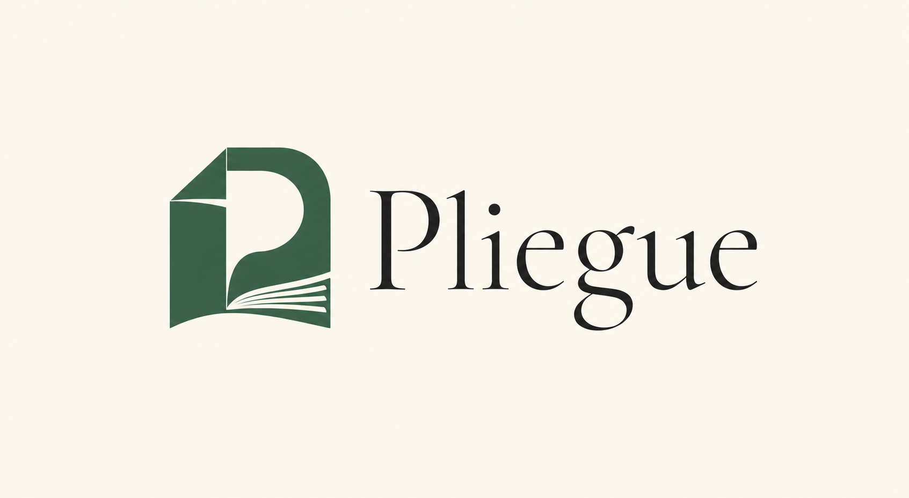
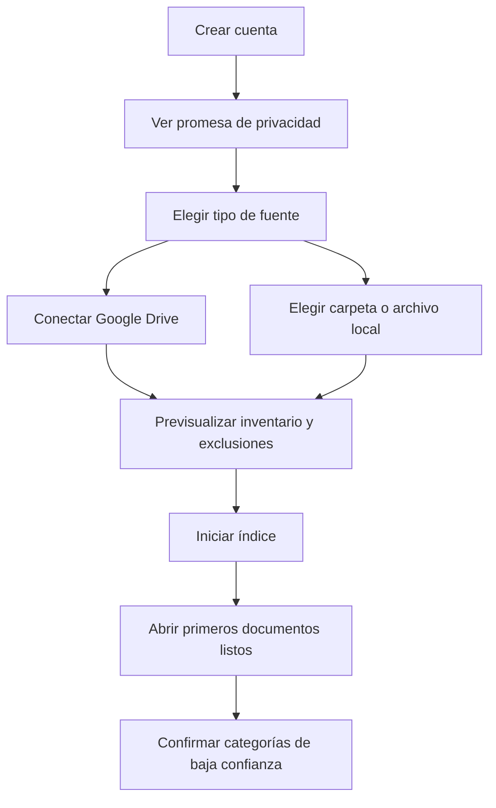
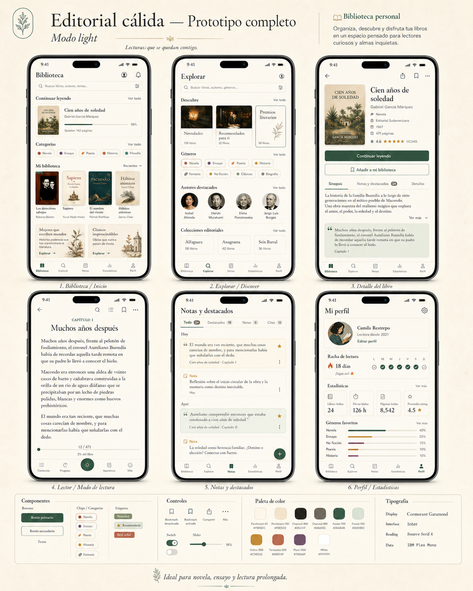
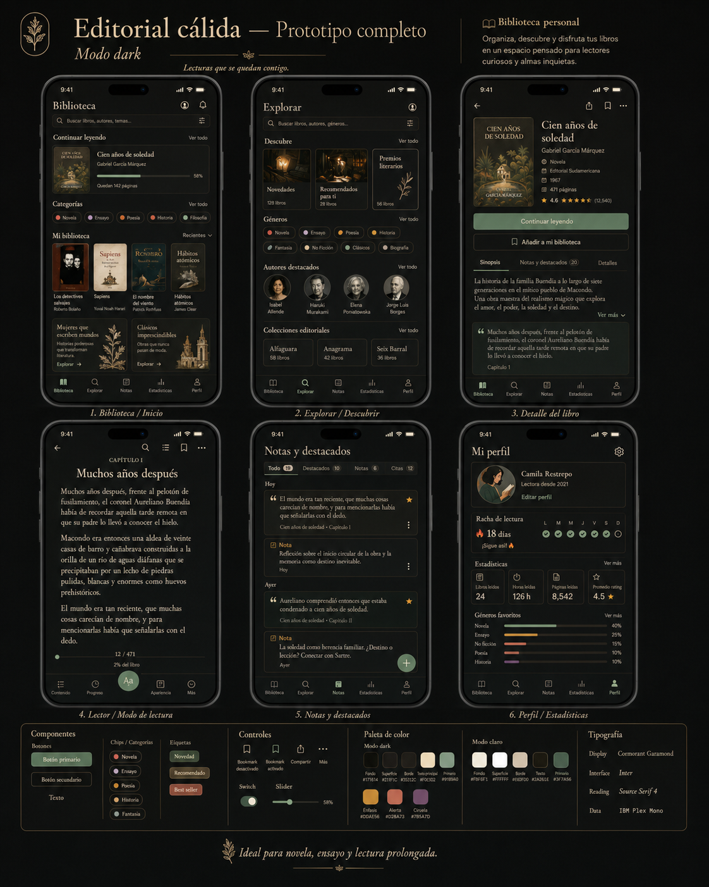

# Pliegue — dossier de producto

> Nombre de trabajo aprobado para prototipo. Su uso comercial queda condicionado a una búsqueda robusta y dictamen de marca.

**Versión:** 0.6  
**Fecha:** 15 de julio de 2026  
**Estado:** decisiones de producto cerradas; validaciones legal y técnica pendientes

## 1. Resumen ejecutivo

**Pliegue convierte Google Drive y los archivos locales en una biblioteca viva.** La persona conecta una carpeta de Drive, elige una carpeta de su equipo o importa archivos desde su dispositivo; la aplicación crea un índice inteligente, propone categorías y permite leer, buscar, preguntar, anotar y compartir fragmentos sin alterar las fuentes originales.

Dentro de una misma **Área de trabajo** pueden convivir fuentes de Drive y fuentes locales. Para cada búsqueda, ordenamiento o acción de IA, el usuario elige un alcance visible: **Todo**, **Solo Drive**, **Solo local** o fuentes específicas. Pliegue también incorpora favoritos, recomendaciones explicables, búsqueda de ofertas y una capa de traducción que conserva el original, las imágenes y las anclas de lectura.

La promesa no es “otra nube de archivos”. Es:

> **Todo lo que guardaste, por fin entendible, legible y conectado.**

El producto debe ser no destructivo por defecto:

- No mueve, renombra ni elimina archivos de Drive o del dispositivo.
- Las categorías de IA son una capa virtual y reversible.
- Cada respuesta de IA enlaza al documento y al pasaje de origen.
- El usuario puede corregir una categoría y entender por qué fue sugerida.
- Al desconectar una fuente puede borrar también el texto extraído, las miniaturas y los vectores.

### Segmento inicial recomendado

Empezar con **investigadores y consultores profesionales hispanohablantes**, independientes o en equipos pequeños, que acumulan PDF, documentos, presentaciones, libros y escaneos entre Drive, Descargas, Documentos y carpetas de proyectos. Comparten una necesidad clara: recuperar evidencia, citarla, traducirla y convertirla en conclusiones sin perder el origen.

No conviene lanzar desde el primer día como gestor universal, red social de lectores o plataforma universitaria completa. La primera versión debe ganar en tres trabajos: **organizar una investigación**, **retomar y comprender documentos extensos** y **preparar una entrega profesional respaldada por fuentes**.

## 2. Oportunidad y diferenciación

Hoy las capacidades están fragmentadas:

- Google Drive almacena y sincroniza, pero su estructura sigue dependiendo de carpetas y nombres.
- NotebookLM razona sobre fuentes con citas, pero no funciona como una biblioteca personal permanente con anotación y organización profunda.
- Readwise Reader ofrece una experiencia de lectura y marcado muy sólida, pero no convierte una carpeta completa de Drive en un sistema organizado automáticamente.
- Zotero domina referencias académicas, metadatos y citas, pero no está planteado como organizador general de Drive con clasificación automática y una experiencia social de captura.
- Fabric y mymind organizan conocimiento con IA, aunque la lectura fiel, la trazabilidad a página y el flujo Drive → lectura → captura no son el centro del producto.
- Acrobat ofrece IA, citas y compartir respuestas para PDF, pero su unidad principal continúa siendo el PDF, no una biblioteca heterogénea conectada a Drive.

### Hueco que puede ocupar Pliegue

**Drive-native + archivos locales + lector universal + organización explicable + IA con citas + estudio/captura social + español primero.**

La interacción memorable será **La Lente**: al seleccionar un párrafo, tabla, imagen o región, aparece una herramienta contextual que puede:

1. Explicarlo de forma simple.
2. Mostrar conceptos relacionados en otros archivos.
3. Detectar coincidencias o contradicciones.
4. Convertirlo en nota, ficha de estudio o tarea.
5. Crear una tarjeta visual lista para compartir, con fuente y controles de privacidad.

## 3. Principios de producto

1. **La fuente manda.** Una afirmación factual de IA debe señalar una fuente verificable.
2. **Las fuentes permanecen intactas.** Drive y los archivos locales son de solo lectura por defecto; la organización inteligente vive en Pliegue.
3. **Primero leer, luego conversar.** La IA complementa al lector; no lo reemplaza.
4. **Toda automatización se puede explicar y deshacer.**
5. **Privado hasta que el usuario decida compartir.**
6. **La misma biblioteca, una experiencia propia por dispositivo.** No forzar una pantalla web idéntica en móvil.
7. **“Todos los formatos” se entrega por niveles.** Un archivo puede tener lectura completa, vista previa, extracción parcial o apertura externa; nunca se promete compatibilidad inexistente.
8. **El alcance de IA siempre es visible.** Pliegue nunca mezcla nube y local de forma silenciosa.

## 4. Módulos del producto

### 4.1 Áreas de trabajo unificadas

Un Área de trabajo es el límite de organización, privacidad y contexto. Puede contener simultáneamente una o varias carpetas de Drive, carpetas locales, archivos importados y capturas de cámara.

El usuario controla el alcance activo mediante un selector persistente:

- **Todo el espacio:** organiza, busca y pregunta cruzando nube y local.
- **Solo Drive:** excluye cualquier contenido local.
- **Solo local:** excluye Drive y otras nubes.
- **Fuentes elegidas:** permite combinar únicamente raíces o archivos marcados.

El alcance se aplica de manera consistente a clasificación, deduplicación, búsqueda, chat, rutas de lectura y recomendaciones internas. Cada respuesta muestra iconos de procedencia y citas; cambiar de alcance vuelve a ejecutar la recuperación. La primera vez que una operación global necesite enviar contenido local a un modelo en la nube, Pliegue solicita consentimiento explícito.

Valores predeterminados por flujo:

- Biblioteca, orden y búsqueda: **Todo el espacio**.
- Preguntar: **documento o selección actual**; el usuario puede ampliar a Todo.
- Traducción: **selección actual**.
- Clasificación y deduplicación: todo el Área, conforme a su política de procesamiento.
- Recomendaciones: gustos declarados + señales explícitas; texto de notas y documentos excluido por defecto.

El consentimiento se recuerda por Área y flujo. Se solicita de nuevo únicamente al cruzar una frontera nueva: primera fuente local enviada a nube, nuevo proveedor, activación de contenido sensible o cambio material de la política; no se repite por calendario.

Un Área de trabajo no es lo mismo que un Espacio inteligente: el área define qué fuentes pueden participar; el espacio inteligente es una vista guardada por tema, proyecto o regla dentro de ese límite.

### 4.2 Fuentes e índice vivo

- Conexión de una carpeta o conjunto de archivos de Google Drive.
- Selección de una carpeta local, archivos individuales o contenido enviado mediante el menú Compartir.
- Exploración recursiva de subcarpetas.
- Detección de archivo nuevo, actualizado, movido, eliminado, desconectado o sin permiso.
- Identidad común para evitar duplicar un mismo documento presente en Drive y en el dispositivo.
- Estado visible por archivo: pendiente, extrayendo, listo, parcial o requiere acción.
- Resumen de carpeta: temas, formatos, fechas, autores, duplicados y elementos sin clasificar.
- Índice híbrido: metadatos, texto completo y búsqueda semántica.

### 4.3 Espacios inteligentes

Un documento no debe pertenecer a una sola categoría. La organización se compone de facetas:

| Faceta | Ejemplos |
|---|---|
| Tipo documental | libro, artículo, contrato, factura, presentación, apuntes |
| Tema | biología, marketing, finanzas, derecho, diseño |
| Proyecto o curso | tesis, Cliente Norte, Historia II |
| Intención | leer, estudiar, consultar, archivar, compartir |
| Estado | nuevo, en progreso, terminado, revisar |
| Sensibilidad | personal, interno, confidencial, público |
| Personas y entidades | autor, empresa, docente, cliente |

La IA propone cada etiqueta con un nivel de confianza y una explicación corta. Una corrección humana tiene prioridad y alimenta las siguientes sugerencias del mismo usuario.

### 4.4 Lector universal

- Dos modos cuando sea posible: **Original** para fidelidad visual y **Fluido** para lectura adaptable.
- Índice semántico, miniaturas, búsqueda dentro del archivo y progreso.
- Tema papel, sepia, oscuro y alto contraste.
- Tamaño, ancho de columna, interlineado y familia tipográfica configurables.
- Lectura en voz alta, control de velocidad y seguimiento de frase.
- Traducción, definición, explicación, resumen y preguntas contextuales.
- Notas, subrayado, dibujo, etiquetas y enlaces entre documentos.
- Reanudación exacta en todos los dispositivos.

### 4.5 Preguntar a la biblioteca

El usuario puede preguntar a:

- un fragmento;
- un documento;
- una categoría o proyecto;
- una carpeta conectada;
- toda el Área de trabajo dentro del alcance activo.

La respuesta debe incluir citas navegables a página, párrafo, celda, diapositiva o código de tiempo. Cuando la evidencia es insuficiente, la respuesta correcta es “no encontré respaldo suficiente”, acompañada de sugerencias para ampliar el alcance.

### 4.6 Captura, cámara y compartir

Hay dos entradas distintas:

1. **Captura del lector:** seleccionar texto o dibujar un rectángulo sobre una página, tabla o imagen.
2. **Cámara móvil:** fotografiar una página física, corregir perspectiva, aplicar OCR y guardarla como nota o nueva fuente.

El Estudio de captura genera formatos 1:1, 4:5 y 9:16 con:

- fragmento o imagen;
- título y autor;
- documento y página;
- comentario personal opcional;
- tema visual de marca;
- código QR o enlace profundo opcional;
- revisión de nombres, correos y otros datos sensibles antes de exportar.

Para documentos marcados como confidenciales, compartir está bloqueado por defecto. El filtro de derechos combina DRM/restricciones técnicas, metadatos de licencia, dominio público por país, sensibilidad, longitud relativa del fragmento y declaración del usuario. Pliegue no evade DRM. En una obra protegida, una tarjeta social parte de un fragmento breve —límite conservador de producto, no “puerto seguro” legal—, atribución y enlace; páginas completas, imágenes o traducciones extensas requieren obra propia, dominio público o permiso confirmado. Un caso incierto se bloquea o se exporta sin contenido protegido.

### 4.7 Rutas de lectura

La IA crea una secuencia de documentos para alcanzar un objetivo:

- “Entender este proyecto en 45 minutos”.
- “Prepararme para el examen del viernes”.
- “Leer primero lo fundamental y después las objeciones”.

Cada ruta muestra duración estimada, prerequisitos y razón del orden. Este módulo puede ser un diferenciador fuerte después del MVP.

### 4.8 Favoritos

- Marcar como favorito un documento, libro externo, fragmento, nota, autor, Área de trabajo o Espacio inteligente.
- Vista global de favoritos con filtros por tipo, origen, tema y estado de lectura.
- Orden manual opcional y acceso offline selectivo.
- La estrella se sincroniza entre dispositivos, pero no modifica el archivo original ni crea una categoría artificial.
- Un favorito externo puede convertirse en “Quiero leer”, alerta de precio o elemento de una ruta.

### 4.9 Descubrir libros y ofertas

Descubrir combina dos estantes claramente separados:

1. **Ya lo tienes:** libros y lecturas presentes en el alcance activo que aún no se han leído o que conviene retomar.
2. **Fuera de tu biblioteca:** libros externos obtenidos de catálogos autorizados.

El perfil de gustos puede incluir géneros, autores, idiomas, temas, duración preferida, formatos, contenido no deseado y presupuesto. Por defecto solo se usan gustos declarados y acciones explícitas: Favorito, Quiero leer, Ya lo leí y No es para mí. El historial de apertura es opt-in; notas, subrayados y texto privado requieren una autorización separada por Área. Toda recomendación responde “¿por qué me lo sugieres?”, enumera las señales usadas y permite **Me interesa**, **No es para mí**, **Ya lo leí**, **No uses este dato** o **Reiniciar perfil**.

El lanzamiento se limita a **Perú**, muestra PEN como moneda principal y conserva la moneda original —normalmente USD— junto al tipo de cambio y su hora. Google Books aporta metadatos, disponibilidad y `saleInfo`; Open Library complementa descubrimiento de bajo volumen respetando sus límites. BuscaLibre Perú es el primer comercio objetivo mediante su programa de afiliados y un feed/API acordado; sin acceso autorizado solo se abre el enlace y no se extrae el precio. Amazon Creators API y otros comercios quedan para una fase posterior, sujetos a elegibilidad y términos vigentes.

El usuario puede activar **Búsqueda libre de ofertas** para consultar la web más allá de los catálogos conectados. El agregador acepta libro físico, ebook o audiolibro, nuevo o usado, pero prioriza APIs, feeds, afiliados y buscadores que permitan este uso. Una página solo se extrae automáticamente cuando sus condiciones y reglas técnicas lo autorizan; Pliegue no elude bloqueos ni mantiene scrapers frágiles como base del producto.

Una oferta debe identificar edición e ISBN, formato, condición, vendedor, país, moneda, precio de lista cuando exista, precio actual, envío e impuestos conocidos, entrega, región/licencia y momento de verificación. Un descuento solo se muestra cuando ambos precios son comparables. Los resultados se marcan como **verificados por proveedor** o **encontrados en la web**; estos últimos exigen confirmar precio final y disponibilidad en el comercio. El usuario puede crear una alerta por precio objetivo, formato, condición y país. Pliegue compara y redirige, pero no compra automáticamente.

Frescura: caché de catálogo de 7 días, ofertas de 6 horas, refresco al abrir una oferta vencida y alertas como máximo cada 6 horas. La interfaz siempre muestra “verificado hace…”.

Los catálogos y comercios externos nunca reciben texto privado de los documentos. Como máximo reciben una consulta o identificadores bibliográficos después de aplicar las preferencias de privacidad.

### 4.10 Traducción visual asistida

La traducción es una capa derivada; nunca reemplaza el original. Ofrece tres vistas:

- **Original:** contenido intacto.
- **Bilingüe:** original y traducción sincronizados lado a lado o línea a línea.
- **Traducido:** texto traducido sobre una capa visual, con acceso inmediato al original.

El flujo recomendado es: detectar idioma → analizar estructura/OCR → separar bloques → aplicar glosario y tono → traducir → validar cifras, citas, nombres y enlaces → renderizar → permitir correcciones. Las traducciones se cachean por versión, idioma, motor y glosario.

Para mantener la composición:

- Las imágenes, diagramas y fotografías permanecen sin cambios.
- Pies de imagen, texto alternativo y etiquetas se traducen como bloques asociados.
- En escaneos se conserva la imagen y se agrega una capa OCR/traducción seleccionable.
- Tablas se traducen celda por celda sin alterar números ni referencias.
- Si una etiqueta está incrustada dentro de una ilustración, se ofrece una superposición reversible; nunca se redibuja silenciosamente el gráfico.
- Cuando un PDF complejo no puede conservar el diseño, se usa vista bilingüe en lugar de simular fidelidad.

El usuario puede crear glosarios por Área de trabajo para nombres propios y terminología técnica. Compartir una traducción completa de una obra protegida está restringido; las exportaciones respetan permisos, licencias y límites de cita.

#### Motores de traducción elegidos

1. **Gratis y privado:** LibreTranslate autoalojado como motor especializado, con Ollama local como alternativa configurable. No tiene costo por carácter, pero consume recursos del dispositivo/servidor y su calidad se presenta como variable.
2. **Gratis de alta calidad con cuota:** DeepL API Free cuando esté disponible para la cuenta y combinación de idiomas. La app lee la cuota real de la API y nunca promete un número fijo en la interfaz.
3. **Pago recomendado por velocidad/calidad:** DeepL API Pro para selección, bloque, vista, página y documentos compatibles.
4. **Pago para documentos complejos:** Google Cloud Translation Advanced como fallback explícito para DOCX/PPTX/XLSX/PDF cuando preservar formato sea más importante; los PDF escaneados o complejos pueden perder composición y vuelven a vista bilingüe.

El usuario elige Gratis, Rápida o Personalizada. Pliegue conserva la memoria/glosario por Área, cifra el caché y crea una versión nueva cuando cambian fuente, glosario o motor. El documento completo solo se exporta si el usuario declara obra propia, dominio público o autorización; en los demás casos la traducción permanece como capa privada y la exportación se limita.

#### Alcances de traducción

| Alcance | Qué incluye | Uso recomendado |
|---|---|---|
| Selección | palabra, oración o fragmento marcado | consulta rápida y menor costo |
| Bloque | párrafo, celda, tabla, pie de imagen o bloque OCR | estudiar una unidad semántica completa |
| Vista actual | bloques visibles al iniciar la orden; se toma una instantánea para que el scroll no cambie el trabajo | lectura continua en pantalla |
| Página | una página lógica o física, incluidas sus notas y pies asociados | PDF, diapositiva o documento paginado |
| Rango personalizado | páginas, bloques o selección desde–hasta | las opciones que faltaban entre página y capítulo |
| Capítulo o sección | nodo completo del índice semántico | lectura prolongada con contexto coherente |
| Documento completo | todos los bloques compatibles, de forma asíncrona y reanudable | obra propia, pública o con permiso suficiente |
| Bilingüe continuo | traduce por anticipado los siguientes bloques durante el avance | opción posterior, con tope de gasto y pausa automática |

Antes de ejecutar se muestra alcance, cantidad estimada de palabras/páginas, proveedor, modelo, costo aproximado, tratamiento de datos y posibilidad de cancelar. El caché se reutiliza únicamente si coinciden versión, idiomas, glosario, motor y parámetros.

### 4.11 Ajustes y perfiles de lectura

El lector guarda los ajustes inmediatamente y permite convertirlos en perfiles con nombre. Los perfiles iniciales son **Día**, **Noche** y **Estudio**; se pueden duplicar y personalizar. La precedencia tipográfica es: ajuste del documento → Área de trabajo → cuenta → valor predeterminado. Tema y luminancia pueden seguir el dispositivo; el brillo físico y la luminancia específica de pantalla nunca se sincronizan. El usuario siempre puede restablecer un nivel sin borrar los demás.

| Ajuste | Rango/opciones | Valor inicial |
|---|---|---|
| Tema | sistema, pergamino, sepia, oscuro, alto contraste | sistema/pergamino |
| Brillo de la app | 40–100 % | 100 % |
| Tamaño de lectura | 14–32 px | 18 px |
| Fuente | Source Serif 4 o alternativa sans serif | Source Serif 4 |
| Altura de línea | 1.55–1.75 | 1.65 |
| Ancho de línea | 55–75 caracteres | 65 caracteres |
| Espacio entre párrafos | 0.8–1.2 em | 1 em |
| Alineación | izquierda o justificada | izquierda |
| Sangría | ninguna, primera línea o personalizada | ninguna |
| Espaciado de letras | normal o ampliado | normal |
| Movimiento | normal o reducido | seguir sistema |

El panel incluye previsualización en vivo, valor numérico junto a cada deslizador, Guardar como perfil, Establecer como predeterminado, Aplicar a este documento/Área/cuenta y Restablecer.

En web, Windows y macOS, “brillo” significa luminancia visual dentro de Pliegue; no modifica el monitor. En Android/iOS puede aplicarse al brillo de la actividad mediante la API nativa y debe restaurar el valor anterior al abandonar el lector. El control del brillo global del sistema nunca es el comportamiento predeterminado.

### 4.12 Memoria y reanudación de lectura

Pliegue guarda la posición durante el avance, al cambiar de página, al pasar a segundo plano y al cerrar el lector. El registro contiene documento y versión, ancla exacta, porcentaje, página/capítulo, desplazamiento, modo Original/Bilingüe/Traducido, perfil de lectura, dispositivo y fecha. No se depende solo de un porcentaje, porque el contenido puede cambiar.

Al volver, una tarjeta **Continúa leyendo** muestra portada, ubicación legible, progreso, último dispositivo y una vista previa breve. El diálogo ofrece **Retomar**, **Empezar desde el inicio**, **Ahora no** y **No volver a preguntar en este libro**. La pregunta aparece únicamente cuando existe progreso útil —por ejemplo, entre 1 % y 95 %— y puede desactivarse globalmente o por documento.

Anclas por formato:

- PDF: página + posición vertical normalizada + huella del texto cercano.
- EPUB: CFI + fragmento de respaldo.
- Documento fluido: bloque + offset + huella.
- Hoja: hoja + celda/rango visible.
- Audio o video: milisegundo + capítulo cuando exista.

La sincronización conserva un historial corto y distingue avanzar de releer. No adopta ciegamente el porcentaje mayor: usa la sesión significativa más reciente y, si dos dispositivos avanzaron offline, muestra ambas ubicaciones antes de descartar una. Las notas y traducciones mantienen sus propias anclas aunque el usuario cambie la posición de lectura.

### 4.13 Panel multIA y enrutamiento por flujo

El panel **Motores de IA** conecta OpenAI, Anthropic Claude y Ollama. Cada tarjeta permite credencial o endpoint, prueba de conexión, modelos disponibles, capacidades, privacidad, latencia observada y costo estimado. Los catálogos se actualizan desde las APIs de cada proveedor; los identificadores de modelos no se fijan en la interfaz ni en migraciones.

#### Matriz de enrutamiento

| Flujo | Capacidades requeridas | Opciones visibles |
|---|---|---|
| Clasificar y etiquetar | texto + salida estructurada | OpenAI, Claude u Ollama compatible |
| Embeddings e índice semántico | modelo específico de embeddings | OpenAI u Ollama; otro proveedor solo si expone esa capacidad |
| OCR/visión y descripción | visión; OCR dedicado como respaldo | OpenAI, Claude u Ollama con visión |
| Preguntar con RAG | texto, contexto suficiente y respuesta estructurable | OpenAI, Claude u Ollama; las citas las valida Pliegue |
| Resumir y explicar | texto, idioma y longitud | cualquier modelo compatible |
| Traducir | idioma, glosario y salida por bloques | cualquier modelo compatible; la composición la controla Pliegue |
| Recomendar | texto estructurado; señales previamente autorizadas | cualquier modelo compatible o reglas locales |
| Reranquear resultados | scoring consistente y económico | modelo compatible o reranker dedicado |
| Contenido sensible/local | ejecución en dispositivo | Ollama por defecto o flujo desactivado |

Se entregan tres preajustes editables: **Privado local**, **Equilibrado** y **Máxima calidad**. Cada fila elige proveedor, modelo, temperatura/razonamiento cuando corresponda, límite de tokens, presupuesto y fallback. El selector impide asignar un modelo sin la capacidad requerida.

#### Ruta inicial “Equilibrado”

| Flujo | Motor predeterminado | Ruta alternativa autorizable |
|---|---|---|
| OCR impreso | Tesseract local | Google Document AI cuando la confianza sea baja |
| Estructura/tablas | parser local | Google Document AI Layout, solo con consentimiento de nube |
| Clasificación y metadatos | OpenAI, nivel económico con salida estructurada | Ollama local compatible |
| Embeddings | OpenAI, modelo dedicado de embeddings | Ollama local de embeddings |
| RAG, explicación y síntesis profunda | Claude, nivel equilibrado | OpenAI equivalente; Ollama para Área local |
| Visión/diagramas | OpenAI con visión | Claude u Ollama con visión |
| Traducción | DeepL Free/Pro según plan | LibreTranslate/Ollama local; Google para documento complejo |
| Recomendaciones | reglas locales + OpenAI económico | Ollama local |
| Contenido confidencial | Ollama/local o desactivado | nube únicamente mediante autorización expresa del Área |

Los nombres concretos se resuelven desde el catálogo de capacidades vigente; el producto guarda niveles y requisitos, no slugs rígidos. El presupuesto avisa al 80 %, bloquea al 100 % salvo ampliación y exige confirmación previa para cualquier trabajo individual estimado por encima del límite definido por el usuario.

Reglas no negociables:

- Las claves BYOK se cifran en servidor o bóveda del sistema y nunca llegan a logs, analítica ni bundles cliente.
- Un fallback no puede cruzar de local a nube de forma silenciosa. Debe estar autorizado por Área de trabajo y por flujo.
- Ollama se descubre en el dispositivo mediante su API local y lista únicamente modelos instalados; el escritorio actúa como broker. Acceso por LAN es opt-in y requiere advertencia de red/TLS.
- Cada operación muestra proveedor efectivo, modelo, alcance documental, consumo y razón de cualquier fallback.
- Un Área de trabajo puede bloquear proveedores, exigir procesamiento local, fijar región o establecer un presupuesto mensual.
- El índice registra qué modelo creó cada embedding; al cambiarlo se reindexa de forma versionada para no mezclar espacios vectoriales incompatibles.

## 5. Arquitectura de información

### Navegación de escritorio y web

1. **Hoy:** pendientes, archivos nuevos, reanudaciones y sugerencias.
2. **Áreas de trabajo:** cambia el límite activo y muestra sus fuentes.
3. **Biblioteca:** documentos, favoritos y vistas guardadas.
4. **Descubrir:** recomendaciones, libros externos, ofertas y alertas.
5. **Preguntar:** búsqueda y conversación con alcance explícito.
6. **Notas:** anotaciones, fichas, capturas y compartidos.
7. **Fuentes:** Drive, carpetas locales, archivos importados, trabajos, errores y consumo.
8. **Ajustes:** lectura, traducción, IA, privacidad, idioma y facturación.

### Navegación móvil

Barra inferior de cinco destinos: **Hoy, Biblioteca, Preguntar, Descubrir, Perfil**. La cámara aparece como acción contextual en Biblioteca y el lector. El selector de Área de trabajo y alcance permanece accesible desde el encabezado.

### Pantalla principal

- Encabezado: Área de trabajo, selector de alcance, búsqueda/comando y estado de fuentes.
- Bloque “Continúa leyendo”.
- Estante “Llegaron a tus fuentes”.
- Estante “Favoritos”.
- Estante “Para ti”, separado entre elementos propios y libros externos.
- Espacios inteligentes con explicación de cambios.
- Cola de clasificación que requiere confirmación.
- Resumen semanal: tiempo leído, documentos terminados y notas creadas.

### Lector de escritorio

Distribución adaptable de cuatro zonas:

| Zona | Ancho sugerido | Contenido |
|---|---:|---|
| Rail | 72 px | navegación global |
| Contexto | 280–320 px | índice, miniaturas, notas |
| Lectura | flexible | página original o texto fluido |
| Copiloto | 340–400 px | La Lente, chat y fuentes |

El panel de copiloto está cerrado por defecto para maximizar la concentración. En tableta se convierte en panel deslizante; en móvil, en hoja inferior.

En el lector, la barra superior agrupa Favorito, alcance de IA, idioma y modo Original/Bilingüe/Traducido. El control de traducción no compite visualmente con las herramientas de anotación.

## 6. Formatos y niveles de soporte

### Nivel A — lectura y análisis completos en el MVP

| Formato | Vista | Extracción | Anotación |
|---|---|---|---|
| PDF digital | original + fluida | texto, estructura, imágenes | texto y región |
| PDF escaneado | original + OCR | OCR con coordenadas | región y texto reconocido |
| Google Docs / DOCX | fluida + exportado | títulos, párrafos, tablas | rango de texto |
| EPUB sin DRM | fluida | capítulos y metadatos | CFI/rango |
| TXT / Markdown | fluida | estructura y código | rango de texto |
| JPG / PNG / HEIC | lienzo con zoom | OCR y visión | región |

### Nivel B — beta posterior

- Google Slides y PPTX: diapositivas, notas y texto por elemento.
- Google Sheets, XLSX y CSV: hojas, rango de celdas y resumen de tablas.
- HTML y RTF.
- MP3, M4A y WAV: transcripción con códigos de tiempo.
- MP4 y MOV: reproductor, transcripción y fotogramas clave.

### Nivel C — vista previa o apertura externa

- ODT/ODS, MOBI/AZW sin DRM, archivos de código, ZIP y formatos especializados.
- Archivos protegidos por contraseña o DRM requieren acción explícita.
- Ejecutables, macros y contenido activo nunca se ejecutan dentro del indexador.

### Anclas de anotación

Para evitar que una actualización rompa todas las notas:

- PDF: página + rectángulos + huella del texto circundante.
- EPUB: CFI + fragmento de respaldo.
- Documento fluido: identificador de bloque + offsets + huella.
- Hoja de cálculo: hoja + rango.
- Audio/video: inicio y fin en milisegundos.

Si cambia una fuente, el sistema intenta reanclar y marca para revisión lo que no pueda resolver con confianza.

## 7. Flujo de IA e indexación

```mermaid
flowchart LR
    A["Drive, carpeta local o archivo"] --> B["Inventario y control de permisos"]
    B --> C["Cola de trabajos idempotente"]
    C --> D["Lectura local, descarga o exportación temporal"]
    D --> E["Parser, OCR o transcripción"]
    E --> F["Documento normalizado con anclas"]
    F --> G["Metadatos y clasificación"]
    F --> H["Fragmentos y embeddings"]
    G --> I["Postgres + búsqueda léxica"]
    H --> I
    I --> J["Filtro por Área, alcance y permisos"]
    J --> K["Recuperación híbrida y reranking"]
    K --> L["Respuesta con citas navegables"]
```



### Pipeline recomendado

1. Registrar metadatos y versión del archivo.
2. Exportar los archivos de Google Workspace al formato de procesamiento apropiado.
3. Pasar el contenido por un parser aislado con límites de tamaño, tiempo y memoria.
4. Aplicar OCR o transcripción solo cuando haga falta.
5. Normalizar títulos, párrafos, tablas, imágenes y coordenadas.
6. Detectar idioma, tipo documental, entidades, sensibilidad y posible duplicado.
7. Dividir por estructura semántica, no solo por cantidad fija de caracteres.
8. Guardar texto para búsqueda completa y embeddings para similitud.
9. Recuperar con búsqueda híbrida, filtrar por permisos y reranquear.
10. Generar una respuesta cuyo mapa de citas se valide antes de mostrarla.

### Reglas de confianza

- Ningún fragmento puede llegar a la IA si el usuario perdió acceso al archivo.
- El `workspace_id`, las fuentes incluidas y los permisos se filtran antes y después de la recuperación.
- Un alcance Drive/local separado se aplica dentro de la consulta léxica y vectorial, no solo al presentar la respuesta.
- Un documento puede contener instrucciones maliciosas; su texto siempre se trata como datos, nunca como instrucciones del sistema.
- Las respuestas distinguen texto de la fuente, inferencia y sugerencia creativa.
- La clasificación automática muestra confianza alta, media o baja; la baja requiere confirmación.
- Las salidas estructuradas se validan con esquemas antes de persistirse.
- Los proveedores de catálogo y ofertas reciben consultas bibliográficas, nunca fragmentos del índice privado.

## 8. Fuentes: Google Drive y archivos locales

### 8.1 Google Drive

#### Flujo de autorización

1. Iniciar sesión en Pliegue.
2. Explicar con lenguaje simple qué se leerá y qué no se modificará.
3. Abrir Google Picker.
4. Elegir carpeta o archivos.
5. Mostrar estimación de cantidad, formatos y tiempo antes de iniciar.
6. Indexar en segundo plano y permitir empezar con los primeros documentos listos.

#### Decisión crítica de OAuth

Google recomienda combinar Picker con `drive.file` por seguridad y mejor experiencia. Ese alcance concede acceso por archivo. La hipótesis de acceso recursivo a todos los descendientes de una carpeta existente debe comprobarse en un **spike técnico con cuentas personales y Shared Drives** antes de cerrar la arquitectura.

Si el producto necesita leer permanentemente una carpeta arbitraria completa y `drive.file` no cubre sus descendientes, podría requerir `drive.readonly`, que Google clasifica como alcance restringido. Una aplicación pública que almacene o transmita esos datos puede necesitar verificación y evaluación de seguridad. Por eso el MVP no debe pedir permisos de escritura y el calendario debe reservar este trámite desde el inicio.

#### Sincronización

- Guardar cursor de cambios por usuario y, cuando aplique, por Shared Drive.
- Recibir notificaciones mediante webhook y consultar el registro de cambios.
- Comparar versión conocida con estado actual; una notificación no contiene necesariamente el delta completo.
- Renovar canales antes de expirar.
- Tratar pérdida de acceso y eliminación como estados distintos cuando sea posible.
- Reindexar solo el archivo afectado y mantener trabajos idempotentes.

### 8.2 Archivos locales

Los archivos locales usan el mismo modelo documental, parsers, categorías, lector, anotaciones y citas que Drive. La diferencia está en cómo cada plataforma concede y conserva el acceso.

| Plataforma | Selección | Comportamiento recomendado |
|---|---|---|
| Windows | selector nativo de archivo o carpeta | lectura recursiva limitada a la raíz elegida, vigilancia de cambios y opción de índice totalmente local |
| macOS | selector nativo + bookmark de seguridad | acceso persistente limitado a lo elegido, watcher, sandbox/entitlements y opción de índice totalmente local |
| Web | File System Access API cuando esté disponible | permiso explícito para archivo/carpeta; al volver puede requerir autorización; fallback mediante selector, arrastrar y soltar o importación |
| Android/iOS | selector de documentos, menú Compartir y cámara | acceso solo a elementos elegidos por el usuario; copia temporal o a la bóveda privada de la app cuando el sistema lo requiera |

#### Estados de una fuente local

- `available`: carpeta montada y permiso vigente.
- `indexing`: inventario o extracción en curso.
- `ready`: índice actualizado.
- `detached`: disco externo, unidad de red o carpeta no disponible.
- `permission_required`: el sistema operativo o navegador exige volver a autorizar.
- `moved`: la raíz cambió de ubicación y requiere confirmación.

La biblioteca conserva el título, las categorías, las notas y el último estado cuando una unidad está desconectada. El contenido no debe usarse para una nueva respuesta de IA si el usuario eligió no conservar texto derivado o si la política de la fuente exige disponibilidad en vivo.

#### Seguridad local

- Pedir lectura, nunca acceso global al disco.
- Limitar el alcance a la carpeta elegida y sus descendientes autorizados.
- No seguir enlaces simbólicos que salgan de la raíz permitida.
- No ejecutar macros, scripts, binarios ni contenido activo.
- Aplicar límites contra archivos comprimidos maliciosos, rutas circulares y archivos excesivos.
- Guardar una referencia opaca a la ruta; no exponer rutas privadas en analítica, logs o tarjetas compartidas.
- Detectar cambios con watcher en Windows/macOS y reconciliar periódicamente el inventario por si se pierde un evento.
- En macOS sandboxed, crear y renovar bookmarks de seguridad solo para las raíces elegidas, liberar el recurso al terminar y mostrar una acción clara si el permiso queda obsoleto.

#### Tres modos de incorporación

1. **Abrir:** lectura puntual; no queda en la biblioteca al cerrar salvo que el usuario lo guarde.
2. **Vincular:** Pliegue conserva permiso y sincroniza los cambios mientras la fuente esté disponible.
3. **Importar:** crea una copia privada administrada por Pliegue para disponer del documento entre dispositivos.

La decisión UX queda cerrada con un **predeterminado contextual**:

- Carpeta en Windows/macOS o navegador compatible: **Vincular**, porque evita duplicados y conserva la fuente como autoridad.
- Archivo individual en móvil o navegador sin permiso persistente: **Importar**, porque garantiza que reaparezca.
- **Abrir una vez** permanece como acción secundaria para revisar algo sin agregarlo.

Antes de indexar se muestra una hoja breve con Fuente original, Qué conservará Pliegue, Dónde se procesará y Cómo retirarlo. El usuario confirma el modo, pero no debe elegir entre tres conceptos técnicos en cada apertura.

## 9. Arquitectura técnica recomendada

### Enfoque

Un monorepo TypeScript con experiencias específicas por plataforma y contratos compartidos. Compartir dominio, tokens, iconos y API; no forzar el 100 % del código visual entre web y móvil.

```text
pliegue/
├── apps/
│   ├── web/              # Next.js App Router
│   ├── mobile/           # Expo + React Native, Android/iOS
│   └── desktop/          # Tauri para Windows y macOS
├── packages/
│   ├── domain/           # entidades, casos de uso y permisos
│   ├── api-client/       # cliente tipado
│   ├── design-tokens/    # color, tipografía, espacio y movimiento
│   ├── ui-web/           # componentes web accesibles
│   ├── ui-native/        # componentes nativos equivalentes
│   ├── reader-core/      # anclas, progreso y anotaciones
│   └── schemas/          # contratos de validación
├── services/
│   ├── control-plane/    # conexiones, biblioteca, notas y shares
│   ├── indexer/          # inventario, exportación y sincronización
│   └── document-workers/ # parsing, OCR, transcripción e IA
└── infrastructure/
    ├── database/
    ├── queues/
    └── observability/
```

### Stack sugerido

| Capa | Elección | Motivo |
|---|---|---|
| Web | Next.js App Router + TypeScript | panel y lector web, rutas compartibles, buen modelo servidor/cliente |
| Móvil | Expo + React Native con development builds | Android/iOS, cámara, share sheet, archivos y notificaciones nativas |
| Escritorio | Tauri para Windows/macOS | selector nativo, lectura local con alcance limitado, vigilancia recursiva e instaladores sin duplicar toda la UI |
| Datos | PostgreSQL/Supabase + RLS | modelo relacional, autenticación y control por usuario/equipo |
| Búsqueda | texto completo + pgvector | recuperación híbrida en una primera etapa |
| Trabajos | cola durable + workers aislados | indexación larga, reintentos e idempotencia |
| Archivos derivados | almacenamiento de objetos cifrado | miniaturas, OCR y exportaciones temporales |
| Observabilidad | logs estructurados, métricas y trazas | depurar cada etapa de un documento |

Tauri también soporta móvil, pero se recomienda Expo para Android/iOS porque el producto necesita cámara, compartir, gestos, descarga y lectura móvil de alta calidad. Tauri queda enfocado en Windows y macOS.

### Matriz de entrega por plataforma

| Plataforma | Paquete | Archivos locales | Integración destacada |
|---|---|---|---|
| Web | PWA/web responsive | abrir, importar y vincular cuando el navegador lo permita | Drive, enlaces compartibles y administración |
| Windows | instalador Tauri firmado | carpetas persistentes, watcher y bóveda local | share target, protocolo propio y funcionamiento offline |
| macOS | DMG y, después, Mac App Store | carpeta persistente mediante sandbox/bookmarks | firma, notarización, entitlements y share extension posterior |
| Android | Expo/React Native | Storage Access Framework, compartir e importar | cámara, notificaciones y lectura offline |
| iOS/iPadOS | Expo/React Native | document picker y copias administradas | cámara, share sheet, archivos y lectura offline |

### Modos de privacidad

1. **Nube privada:** el servidor procesa y guarda texto derivado y embeddings cifrados. Es la opción más consistente para web y sincronización entre dispositivos.
2. **Vinculado al dispositivo:** el archivo original permanece local; Pliegue guarda derivados cifrados para búsqueda y continuidad entre dispositivos, solo con consentimiento.
3. **Bóveda local:** la app de Windows/macOS mantiene contenido, índice y, progresivamente, modelos locales. Puede sincronizar únicamente metadatos o notas elegidas. El MVP web admite archivos locales, pero el modo completamente local se entrega con la app de escritorio.

### Región, identidad y recuperación

- Región primaria de base de datos y objetos: **São Paulo (`sa-east-1`)**, cercana al mercado inicial peruano. Metadatos y derivados de un Área se mantienen en la misma región cuando el proveedor lo permita.
- Los proveedores externos de IA se tratan como subencargados independientes; región y retención se muestran por ruta. Un requisito de residencia incompatible desactiva esa ruta en lugar de degradarla silenciosamente.
- Web con Drive/sincronización: cuenta obligatoria mediante Google o enlace mágico por correo. Escritorio: **modo local sin cuenta** disponible desde el inicio.
- La bóveda local se cifra con una clave guardada en el almacén seguro del sistema. Al activar sincronización cifrada se genera un código de recuperación; sin ese código ni un dispositivo autorizado, Pliegue no promete recuperar el contenido cifrado.
- Una biblioteca local puede convertirse en cuenta conservando identificadores y notas, sin duplicar originales.

### Derivados, desconexión y borrado

- Si una unidad queda temporalmente `detached`, se conservan metadatos, notas, favoritos, progreso, miniaturas y el índice local cifrado. No se generan respuestas nuevas desde contenido inaccesible; las respuestas previas se muestran como históricas.
- El original vinculado nunca se copia a nube sin activar **Sincronizar contenido**. En modo importado, Pliegue administra una copia cifrada.
- **Quitar vínculo** conserva notas/progreso y elimina el permiso. **Eliminar de Pliegue** retira original importado y derivados del sistema activo en 24 horas, del índice/colas en 7 días y de backups rotativos en un máximo de 35 días.
- El usuario recibe un comprobante de borrado con categorías afectadas y fecha máxima de purga. Los eventos mínimos de auditoría se conservan sin texto documental cuando la ley lo exija.

## 10. Modelo de datos inicial

| Entidad | Responsabilidad |
|---|---|
| `accounts` | usuario, equipo, plan y región |
| `workspaces` | Área de trabajo, propietario, políticas de privacidad e idioma |
| `workspace_sources` | fuentes vinculadas y reglas de inclusión en el alcance global |
| `saved_scopes` | Todo, Drive, local o selección explícita reutilizable |
| `connections` | proveedor (`google_drive`, `local_web`, `local_windows`, `local_macos`, `device_picker`), scopes y estado; secretos cifrados fuera de columnas públicas |
| `source_roots` | carpeta, conjunto de archivos o importación; referencia opaca, modo de incorporación y política de retención |
| `source_access_grants` | alcance autorizado, plataforma, permiso y última validación |
| `documents` | identidad canónica, metadatos normalizados y huella de contenido |
| `document_instances` | ubicación concreta en Drive/local, identificador del proveedor, ruta opaca y disponibilidad |
| `document_versions` | checksum, versión remota y estado de indexación |
| `content_blocks` | títulos, párrafos, tablas, imágenes y anclas |
| `chunks` | fragmentos recuperables y metadatos de contexto |
| `embeddings` | vector, modelo y versión del chunk |
| `categories` | faceta, nombre, color y origen humano/IA |
| `document_categories` | relación, confianza, explicación y confirmación |
| `annotations` | tipo, ancla, cuerpo, color y visibilidad |
| `favorites` | sujeto favorito, tipo, orden, nota y disponibilidad offline |
| `reading_progress` | posición vigente por usuario, documento y dispositivo |
| `reading_sessions` | inicio, fin, tiempo activo, modo, dispositivo y última ancla significativa |
| `reading_position_history` | historial corto para conflicto offline, relectura y recuperación |
| `resume_preferences` | preguntar siempre/global/por documento y opciones de reanudación |
| `reading_profiles` | perfil nombrado, tema, tipografía, espaciado y alcance predeterminado |
| `reader_preferences` | overrides por cuenta, Área de trabajo o documento |
| `device_display_preferences` | brillo de app y ajustes que no deben sincronizarse entre pantallas |
| `conversations` / `messages` | alcance consultado, respuesta y mapa de citas |
| `reading_preferences` | gustos declarados, señales permitidas, exclusiones, idioma y presupuesto |
| `recommendation_events` | explicación, impresión, apertura y feedback del usuario |
| `catalog_books` / `book_editions` | obra externa, autores, ISBN, idioma, formato y portada |
| `book_offers` | proveedor, país, moneda, precio, envío, URL y fecha de verificación |
| `offer_sources` / `offer_search_runs` | API/feed/web, autorización de extracción, consulta, país, estado y frescura |
| `price_alerts` | edición/formato, país, precio objetivo y canal de aviso |
| `translations` | documento/versión, idiomas, motor, glosario, estado y calidad |
| `translation_blocks` | ancla original, texto traducido, geometría y corrección humana |
| `glossary_terms` | término, traducción preferida y alcance de Área de trabajo |
| `ai_providers` | OpenAI, Anthropic, Ollama o adaptador futuro; endpoint y estado |
| `ai_credentials` | referencia cifrada, propietario, alcance y rotación; nunca la clave en claro |
| `ai_models` / `ai_capabilities` | catálogo dinámico, modalidades, contexto, funciones y fecha de refresco |
| `ai_workflow_routes` | flujo, proveedor/modelo, parámetros, límite, privacidad y prioridad |
| `ai_fallbacks` | cadena autorizada y límite de cruce local/nube |
| `ai_usage_events` / `ai_budgets` | tokens/unidades, costo estimado, latencia, error y presupuesto por Área/flujo |
| `share_cards` | plantilla, redacciones, fuente y estado público |
| `sync_cursors` | cursor remoto, checkpoint de inventario o estado del watcher por fuente |
| `jobs` / `job_attempts` | etapa, progreso, errores y reintentos |
| `audit_events` | acceso, exportación, compartido y borrado |
| `local_vaults` / `recovery_kits` | referencia de clave del SO, dispositivos autorizados y estado del código; nunca la clave en claro |
| `export_jobs` / `deletion_receipts` | alcance, artefactos, progreso, checksum y fechas 24 h/7 d/35 d |
| `rights_assessments` | licencia, país, DRM, dominio público, declaración, confianza y acciones permitidas |
| `vendor_terms_registry` | fuente comercial/IA, versión de términos, campos permitidos, caché, revisión y baja |

Todas las tablas de usuario o equipo deben aplicar RLS. Las claves de proveedor y refresh tokens requieren cifrado administrado por KMS o un almacén de secretos.

## 11. Sistema visual

### Concepto creativo

**Editorial cálida: biblioteca personal + mesa de estudio.** La experiencia debe sentirse literaria, artesanal y contemplativa, pensada para novelas, ensayos, poesía y sesiones prolongadas. La lectura tiene prioridad sobre la decoración; las superficies son cálidas, tranquilas y poco saturadas.

Rasgo memorable: una línea vertical de margen acompaña la lectura y se “pliega” para revelar notas, fuentes relacionadas y acciones de La Lente.

### Marca

- Símbolo: una hoja doblada que forma simultáneamente una `P` y el lomo de un libro.
- Logotipo: `Pliegue` en una serif expresiva, sin agregar “AI” al nombre.
- Frase principal: **Tu archivo empieza a pensar.**
- Voz: serena, precisa, curiosa y nunca omnisciente.



El archivo mostrado es un concepto de dirección, no todavía un master de producción. Antes del lanzamiento se debe reconstruir como SVG, corregir ópticamente símbolo y kerning, probar monocromo/16 px y registrar nombre y marca.

### Paleta clara

| Token | Valor | Uso |
|---|---:|---|
| `parchment-50` | `#FBF6EC` | fondo principal de lectura |
| `parchment-100` | `#F0E5D2` | paneles, tarjetas y separadores |
| `charcoal-900` | `#25231F` | texto principal, títulos e iconos prioritarios |
| `charcoal-600` | `#6B655C` | texto secundario y metadatos |
| `forest-700` | `#365B48` | acción principal, navegación activa y progreso |
| `forest-100` | `#DDE9E0` | selección, citas y estados positivos |
| `ochre-500` | `#C99232` | descubrimientos, puntuaciones y novedades |
| `terracotta-500` | `#B9674F` | captura, alertas y errores recuperables |
| `plum-500` | `#76566F` | colecciones, ensayo y categorías culturales |
| `white` | `#FFFFFF` | superficies elevadas puntuales |

### Paleta oscura

| Token | Valor | Uso |
|---|---:|---|
| `dark-950` | `#171614` | fondo principal de bajo brillo |
| `dark-900` | `#211F1C` | superficies, tarjetas y paneles |
| `dark-800` | `#35312C` | bordes y divisores |
| `parchment-100` | `#F0E5D2` | texto principal |
| `parchment-muted` | `#BEB3A1` | texto secundario y metadatos |
| `forest-300` | `#91B9A0` | acción principal, progreso y navegación activa |
| `ochre-400` | `#DDAE56` | destacados, logros y puntuaciones |
| `terracotta-400` | `#D28A73` | captura y estados de atención |
| `plum-400` | `#A98AA3` | categorías y etiquetas especiales |

En modo oscuro se evita el negro puro y las grandes áreas blancas. El color de categoría se presenta con punto, cinta, icono, etiqueta o borde; nunca como único indicador.

### Colores por categoría

| Categoría | Color |
|---|---|
| Novela | `terracotta-500` |
| Ensayo | `plum-500` |
| Poesía | `ochre-500` |
| Historia | `#A8753E` |
| Filosofía | `forest-700` |
| Fantasía | `#587A70` |
| No ficción | `charcoal-600` |
| Biografía | `#8A6D58` |

### Tipografía

| Rol | Familia | Uso |
|---|---|---|
| Display | **Cormorant Garamond** | marca, portadas, capítulos y frases destacadas; nunca controles ni texto menor a 18 px |
| Interfaz | **Inter** | navegación, botones, filtros, formularios y metadatos |
| Lectura | **Source Serif 4** | texto continuo, sinopsis, citas, notas y concentración |
| Datos | **IBM Plex Mono** | páginas, códigos, tamaños, estados técnicos |

Escala base: 12, 14, 16, 18, 22, 28, 36 y 52 px. Pesos: 400 para cuerpo; 500 para navegación, introducciones y datos destacados; 600 para botones y encabezados; 700 solo para estados críticos o cifras puntuales. El lector usa 18 px/1.65 por defecto y permite 14–32 px.

### Forma, profundidad y movimiento

- Radios: botones 8 px, búsquedas 10 px, tarjetas 12 px, paneles 16 px, chips 999 px y portadas 4–6 px.
- Bordes claros `#DDD2C0`; bordes oscuros `dark-800`.
- Sombra clara: `0 4px 16px rgba(37, 35, 31, 0.08)`; oscura: `0 6px 20px rgba(0, 0, 0, 0.28)`; solo para capas temporales.
- Fondo con grano de papel casi imperceptible y líneas de margen, desactivables en modo accesible.
- Animación principal: al abrir un archivo, la tarjeta se expande y se convierte en el lienzo de lectura.
- Duraciones: 120 ms para respuesta, 220 ms para panel, 360 ms para transición editorial.
- Respetar `prefers-reduced-motion` y evitar que el movimiento comunique información exclusiva.

### Accesibilidad mínima

- Objetivo WCAG 2.2 AA.
- Navegación completa por teclado y foco siempre visible.
- Lectura con VoiceOver, TalkBack y NVDA.
- Etiquetas accesibles para botones de icono.
- Alto contraste, reducción de movimiento y opción de fuente de lectura alternativa.
- Zoom hasta 200 % sin pérdida de función.
- Objetivos táctiles mínimos de 44 × 44 px.
- El lector permite tema, brillo, fuente, tamaño, interlineado, ancho, párrafos y espaciado.
- OCR y texto alternativo de IA se presentan como sugerencias editables, nunca como verdad garantizada.

### Variables CSS base

```css
:root {
  --parchment-50: #fbf6ec;
  --parchment-100: #f0e5d2;
  --charcoal-900: #25231f;
  --charcoal-600: #6b655c;
  --forest-700: #365b48;
  --forest-100: #dde9e0;
  --ochre-500: #c99232;
  --terracotta-500: #b9674f;
  --plum-500: #76566f;
  --background: var(--parchment-50);
  --surface: var(--parchment-100);
  --text-primary: var(--charcoal-900);
  --text-secondary: var(--charcoal-600);
  --primary: var(--forest-700);
  --font-display: "Cormorant Garamond", Georgia, serif;
  --font-interface: "Inter", system-ui, sans-serif;
  --font-reading: "Source Serif 4", Georgia, serif;
  --font-data: "IBM Plex Mono", monospace;
}

[data-theme="dark"] {
  --background: #171614;
  --surface: #211f1c;
  --surface-elevated: #35312c;
  --text-primary: #f0e5d2;
  --text-secondary: #beb3a1;
  --primary: #91b9a0;
  --accent: #ddae56;
  --warning: #d28a73;
  --category-special: #a98aa3;
}
```

## 12. Catálogo y contratos de componentes

Cada componente debe documentarse en Storybook o equivalente con estados normal, hover, foco, activo, cargando, vacío, error, sin permiso y offline cuando corresponda.

### Fundamentos

| Componente | Contrato clave |
|---|---|
| `Button` | variantes primary, secondary, quiet, danger; loading conserva ancho |
| `IconButton` | `aria-label` obligatorio; tooltip en escritorio |
| `TextField` | etiqueta persistente, ayuda, error y contador opcional |
| `Tag` | faceta, color, origen IA/humano y acción de quitar |
| `StatusBadge` | texto + icono + color; nunca solo color |
| `Progress` | valor conocido o indeterminado; texto de etapa asociado |
| `Tooltip` | ayuda complementaria, nunca contenido esencial |
| `Skeleton` | refleja la forma final y no roba foco |

### Navegación y biblioteca

| Componente | Responsabilidad |
|---|---|
| `AppRail` | destino global, cuenta y estado de conexión |
| `MobileTabBar` | cinco destinos; cámara como acción contextual separada |
| `WorkspaceSwitcher` | Área activa, creación, cambio y política de privacidad |
| `ScopeSelector` | Todo, Drive, local o fuentes elegidas; siempre visible al usar IA |
| `SourceScopePills` | procedencia incluida y exclusiones de la operación actual |
| `CommandPalette` | buscar, navegar y ejecutar acciones con teclado |
| `LibraryToolbar` | vista, orden, filtros y selección múltiple |
| `DocumentCard` | portada/miniatura, título, tipo, progreso, categorías y estado |
| `DocumentRow` | variante densa con columnas configurables |
| `FavoriteButton` | alterna favorito, confirma estado accesible y permite nota opcional |
| `ContinueReadingCard` | portada, última ubicación, progreso, dispositivo y acción Retomar |
| `ResumeReadingDialog` | Retomar, empezar de nuevo, ahora no o no preguntar en este libro |
| `ReadingPositionSyncStatus` | guardado local/nube, conflicto y elección entre ubicaciones |
| `SmartSpaceCard` | regla del espacio, conteo y explicación de cambios |
| `FacetFilter` | filtros combinables con chips y conteos |
| `SyncStatus` | última sincronización, cola y errores accionables |
| `EmptyState` | explica el valor y ofrece una acción primaria concreta |

### Fuentes e indexación

| Componente | Responsabilidad |
|---|---|
| `SourceTypePicker` | elegir Drive, carpeta local, archivo, cámara o importación |
| `DriveConnectionCard` | cuenta, alcance, estado y desconexión |
| `LocalSourceCard` | dispositivo, raíz, disponibilidad, modo y última reconciliación |
| `SourceRootPicker` | carpeta o archivos elegidos, exclusiones y tipo de fuente |
| `PermissionNotice` | permiso solicitado explicado antes de OAuth |
| `LocalProcessingNotice` | explica lectura puntual, vínculo, importación y destino del procesamiento |
| `ImportModeDecisionSheet` | aplica el predeterminado contextual y explica original, copia, proceso y retirada |
| `IndexJobPanel` | progreso por etapas, archivos listos y fallos |
| `FormatSupportList` | completo, parcial, externo o no compatible |
| `ReauthorizeBanner` | pérdida de acceso sin ocultar la biblioteca restante |

### Lector e IA

| Componente | Responsabilidad |
|---|---|
| `ReaderShell` | coordinación de paneles, atajos y modo concentración |
| `OriginalCanvas` | página/diapositiva, zoom, selección y superposición OCR |
| `ReflowReader` | tipografía, ancho, tema, búsqueda y anclas |
| `TranslationModeSwitch` | Original, Bilingüe o Traducido sin perder posición |
| `TranslationToolbar` | idioma, alcance, glosario, calidad y progreso |
| `TranslationScopePicker` | selección, bloque, vista, página, rango, capítulo o documento con estimación |
| `TranslationPlanSelector` | Gratis, Rápida o Personalizada; cuota/costo, privacidad y calidad esperada |
| `BilingualBlock` | alinea bloque original y traducción con ancla compartida |
| `TranslatedOverlay` | superposición reversible sobre PDF o imagen con geometría |
| `ReaderSettingsSheet` | tema, brillo, tipografía, ancho, párrafos y movimiento con vista previa |
| `ReadingPresetCard` | aplicar, renombrar, duplicar o eliminar un perfil guardado |
| `BrightnessControl` | luminancia de app y, solo en móvil autorizado, brillo de actividad |
| `TypographyPreview` | muestra un fragmento real antes de guardar cambios |
| `PreferenceScopeSelector` | aplicar a documento, Área de trabajo o cuenta |
| `SettingsSaveStatus` | guardando, guardado, sin conexión o conflicto; anunciado accesiblemente |
| `OutlinePanel` | índice semántico, miniaturas y resultados internos |
| `AnnotationToolbar` | subrayar, nota, dibujar, enlazar y capturar |
| `LensPopover` | explicar, relacionar, preguntar, crear ficha o compartir |
| `AssistantPanel` | alcance explícito, conversación y estado de recuperación |
| `CitationChip` | archivo + ubicación; activa navegación exacta |
| `SourceDrawer` | evidencia usada, fragmento y contexto ampliable |
| `ReadAloudBar` | reproducir, velocidad, voz y seguimiento |

### Configuración de IA

| Componente | Responsabilidad |
|---|---|
| `AIProviderPanel` | proveedores conectados, privacidad, salud, consumo y acciones globales |
| `ProviderCard` | credencial/endpoint, estado, latencia y modelos descubiertos |
| `ProviderConnectionTest` | prueba autenticación, disponibilidad y respuesta sin usar documentos privados |
| `ModelPicker` | filtra por capacidad y muestra contexto, modalidad y costo conocido |
| `CapabilityBadge` | texto, visión, embeddings, estructurado, herramientas, local u otras capacidades |
| `WorkflowRoutingTable` | asigna modelo y parámetros a clasificación, RAG, traducción y demás flujos |
| `FallbackChainEditor` | orden y condiciones; bloquea cruces de privacidad no autorizados |
| `PrivacyBoundaryBadge` | local, nube, región y datos enviados con texto además de color |
| `AIBudgetMeter` | consumo estimado/real por Área y flujo, alertas y límite duro opcional |

### Descubrir y ofertas

| Componente | Responsabilidad |
|---|---|
| `RecommendationShelf` | separa biblioteca propia de catálogo externo y explica el contexto |
| `BookRecommendationCard` | portada, motivo, afinidad, formato, idioma y acciones de feedback |
| `TasteProfileEditor` | gustos declarados, señales permitidas, exclusiones y presupuesto |
| `OfferCard` | edición, vendedor, formato, precio, moneda, país y verificación |
| `OfferSourceBadge` | API/feed verificado o hallazgo web pendiente de confirmar |
| `FreeWebSearchToggle` | activa búsqueda libre y explica fuentes, privacidad y posibles resultados incompletos |
| `PriceHistory` | evolución comparable de una misma edición y proveedor |
| `PriceAlertForm` | precio objetivo, formato, país y canal de aviso |
| `ExternalCatalogNotice` | identifica datos externos y qué consulta se enviará |

### Captura y compartir

| Componente | Responsabilidad |
|---|---|
| `CaptureOverlay` | selección rectangular accesible y reajustable |
| `QuoteCardEditor` | jerarquía, tema, comentario y fuente |
| `AspectRatioPicker` | 1:1, 4:5, 9:16 y tamaño personalizado |
| `PrivacyCheck` | sensibilidad, PII detectada y redacción |
| `RightsGate` | licencia, DRM, país, longitud, atribución y acción permitida/bloqueada |
| `SharePreview` | vista final exacta y texto alternativo editable |
| `ShareDestinationSheet` | guardar, copiar, enlace y share sheet nativo |

### Reglas de contenido

- “La IA sugiere…” en lugar de “La IA decidió…”.
- “No pudimos leer 3 páginas” en lugar de “Error de OCR”.
- Los estados siempre indican qué ocurrió, qué permanece seguro y qué puede hacer el usuario.
- Una cifra de archivos nunca debe aparecer sin contexto de carpeta o filtro.

## 13. Flujos críticos

### A. Primera conexión



### B. Leer y comprender

1. Abrir desde Hoy o Biblioteca.
2. Reanudar en la última posición.
3. Seleccionar un fragmento.
4. Abrir La Lente y elegir “Explicar”.
5. Ver explicación y fuentes relacionadas.
6. Convertir el resultado en nota sin perder la selección original.

### C. Crear una captura social

1. Seleccionar texto o región.
2. Elegir “Crear captura”.
3. Aplicar plantilla, proporción y comentario.
4. Revisar fuente, privacidad y texto alternativo.
5. Compartir mediante el sistema operativo o guardar imagen.

### D. Corregir la IA

1. Abrir el detalle de una categoría sugerida.
2. Ver evidencia y confianza.
3. Confirmar, reemplazar o excluir.
4. Aplicar la corrección solo al documento o como preferencia futura.

### E. Preguntar cruzando nube y local

1. Entrar a un Área de trabajo que contenga Drive y una carpeta local.
2. Abrir `ScopeSelector` y elegir Todo, Drive, local o fuentes concretas.
3. Revisar el aviso de procesamiento si contenido local saldrá del dispositivo.
4. Formular la pregunta.
5. Recibir una respuesta cuyas citas distinguen origen, archivo y ubicación.
6. Cambiar el alcance y comparar el resultado sin perder la conversación.

### F. Traducir respetando la composición

1. Elegir selección, bloque, vista, página, rango, capítulo o documento.
2. Seleccionar idioma, glosario y modo Bilingüe/Traducido.
3. Mostrar proveedor/modelo, estimación de tamaño/costo y advertir limitaciones del formato.
4. Procesar bloques, tablas, pies de imagen y OCR sin alterar el original.
5. Revisar cifras, nombres y regiones marcadas con baja confianza.
6. Guardar la traducción como capa derivada o exportar si la licencia lo permite.

### G. Descubrir y seguir una oferta

1. Configurar gustos de forma explícita o autorizar señales de la biblioteca.
2. Ver por separado “Ya lo tienes” y “Fuera de tu biblioteca”.
3. Abrir “¿Por qué?” para entender la recomendación.
4. Buscar en catálogos conectados o activar Búsqueda libre para físico, digital, audio, nuevo o usado.
5. Comparar ofertas de la misma edición, formato, condición y país; confirmar hallazgos web en la tienda.
6. Marcar Favorito, Quiero leer o crear una alerta de precio.

### H. Retomar una lectura

1. Abrir Pliegue y ver **Continúa leyendo** con la última ubicación sincronizada.
2. Elegir Retomar, empezar desde el inicio, ahora no o no preguntar para ese libro.
3. Restaurar ancla, modo de traducción y perfil de lectura sin sobrescribir el brillo local del dispositivo.
4. Si dos equipos avanzaron offline, comparar fecha, capítulo y vista previa antes de elegir una ubicación.
5. Guardar la nueva posición de forma local inmediata y sincronizarla en segundo plano.

### I. Configurar qué IA usa cada flujo

1. Conectar OpenAI, Claude u Ollama y ejecutar una prueba sin documentos privados.
2. Refrescar modelos y capacidades disponibles.
3. Aplicar Privado local, Equilibrado o Máxima calidad, o editar fila por fila.
4. Asignar proveedor/modelo a clasificación, embeddings, visión, RAG, resumen, traducción, recomendación y reranking.
5. Definir presupuesto y fallback; autorizar explícitamente cualquier salto local → nube.
6. Ejecutar una prueba por flujo y guardar una configuración versionada y auditable.

## 14. MVP realista

### Debe incluir

- Web responsive con cuenta personal.
- Conexión de una carpeta de Drive y sincronización incremental.
- Apertura e importación de archivos locales; selección de carpeta en navegadores compatibles, con fallback por selector o arrastrar y soltar.
- Un Área de trabajo que combine Drive y local, con alcance Todo/Drive/local/fuentes elegidas para ordenar, buscar y usar IA.
- Favoritos para documentos, fragmentos y libros externos.
- PDF digital/escaneado, Google Docs, DOCX, EPUB, TXT/MD e imágenes.
- Inventario, filtros, categorías sugeridas y corrección manual.
- Búsqueda híbrida y preguntas a documento/carpeta con citas.
- Lector PDF y fluido, progreso, subrayado, notas, guardado de posición y aviso para retomar.
- Ajustes guardados de tema, brillo de app, fuente, tamaño, interlineado, ancho y párrafos, con perfiles Día/Noche/Estudio.
- Traducción de selección, bloque, vista y página con vista Original/Bilingüe y preservación de imágenes.
- Panel multIA con OpenAI y Claude operativos en web; Ollama aparece configurable con estado **Requiere app de escritorio** hasta habilitar el broker local. Incluye rutas para clasificación, embeddings, RAG y traducción.
- Recomendaciones de la propia biblioteca y un catálogo externo inicial con explicación.
- Una fuente inicial de precios/ofertas y búsqueda libre opcional, con físico/digital/audio, condición, país, moneda y fecha de verificación.
- Captura rectangular y tarjeta 1:1/4:5/9:16.
- Centro de sincronización, privacidad y borrado del índice.
- Español completo; inglés preparado mediante i18n.

### No debe incluir todavía

- Edición o reorganización automática de Drive o de carpetas locales.
- Colaboración compleja en tiempo real.
- Agentes que ejecuten acciones externas.
- Garantía de ejecución completamente local para todos los formatos/flujos y sincronización automática de cualquier carpeta móvil; Ollama se activa con la entrega de escritorio.
- Compatibilidad prometida con cualquier archivo.
- Mercado de plugins o flujos empresariales avanzados.
- Comparador de todas las librerías, compra automática o scraping de comercios.
- Garantía de conservación perfecta para todo PDF escaneado o diseño complejo.

### Criterios de aceptación

1. Una biblioteca de 1,000 archivos puede inventariarse sin bloquear la interfaz.
2. Un archivo listo aparece antes de que termine toda la carpeta.
3. Una respuesta factual contiene citas navegables o declara evidencia insuficiente.
4. Un cambio remoto o local reindexa únicamente la versión afectada.
5. La pérdida de permiso en cualquier fuente retira el archivo de recuperación de IA según su política de derivados.
6. Una nota sigue anclada después de una actualización menor o queda marcada para revisión.
7. Desconectar y borrar elimina tokens y datos derivados verificablemente.
8. Los flujos esenciales funcionan con teclado y lector de pantalla.
9. El mismo formato ofrece las mismas funciones de lectura, notas y citas sin importar si procede de Drive o del dispositivo.
10. Una carpeta local desconectada conserva su organización y muestra un estado claro sin generar respuestas nuevas con contenido no autorizado.
11. El alcance separado nunca recupera fragmentos de una fuente excluida; el global distingue Drive y local en cada cita.
12. Favoritos se sincroniza entre dispositivos sin modificar las fuentes.
13. Cada recomendación muestra una razón y acepta feedback negativo.
14. Cada oferta identifica edición, formato, condición, país, moneda, fuente y momento de verificación; un hallazgo web exige confirmación externa.
15. La traducción respeta exactamente el alcance elegido y conserva original, imágenes, cifras, citas y anclas; si pierde diseño usa una vista bilingüe explícita.
16. Un ajuste guardado reaparece al abrir otro dispositivo según su alcance; el brillo específico del equipo permanece local.
17. Los controles de lectura actualizan una previsualización en vivo, funcionan con teclado y muestran valores numéricos.
18. Al cerrar y reabrir un documento se restaura su ancla exacta; un conflicto offline conserva ambas posiciones hasta que se resuelva.
19. Un proveedor/modelo incompatible no puede asignarse al flujo; la configuración indica el motivo.
20. Un flujo marcado local nunca activa un fallback de nube sin consentimiento explícito y registrable.
21. Cada operación de IA deja visible proveedor, modelo, alcance, consumo y fallback efectivo.

## 15. Hoja de ruta sugerida

Estimación orientativa para un equipo pequeño de producto/diseño, dos desarrolladores y apoyo de infraestructura/IA.

### Fase 0 — validación y riesgos, 2–3 semanas

- 12 pruebas moderadas: 6 investigadores y 6 consultores, con las compuertas de éxito del registro de decisiones.
- Prototipo navegable de Hoy, Área de trabajo, Biblioteca, Lector, Descubrir, Captura y Motores de IA, contrastado con las referencias visuales del proyecto.
- Spike de OAuth, carpeta recursiva, Shared Drives y cambios.
- Spike de carpeta local en web, Windows y macOS: permisos, bookmark/sandbox, watcher, disco externo, renombrado y pérdida de acceso.
- Prueba de alcance global/separado, consentimiento de IA y prevención de fuga entre fuentes.
- Validación de Google Books, primer proveedor de ofertas, país/moneda y condiciones de afiliación.
- Corpus de traducción con PDF nativo, escaneado, tablas, diagramas, DOCX y EPUB.
- Corpus cerrado de 100 documentos con licencia segura y matriz esperada de extracción, anclas, traducción y rendimiento.
- Prueba de rutas OpenAI/Claude/Ollama, registro dinámico de capacidades, aislamiento local/nube y presupuesto por 1,000 páginas indexadas y 100 preguntas.

### Fase 1 — web alpha, 8–12 semanas

- Autenticación, Drive, importación local web, cola, parsers Nivel A y modelo de datos común para fuentes.
- Área de trabajo unificada, alcance visible, favoritos, biblioteca, lector, notas, clasificación, búsqueda y reanudación entre sesiones.
- Perfiles de lectura sincronizados y panel de ajustes con previsualización.
- IA con citas, panel de proveedores, rutas por flujo, límites y trazabilidad.
- Traducción de selección/bloque/vista/página y recomendaciones sobre la biblioteca propia.
- Catálogo externo y ofertas de un proveedor inicial.
- Captura social básica.
- Pruebas cerradas con 20–40 usuarios.

### Fase 2 — beta y calidad, 6–8 semanas

- Sincronización robusta, reanclaje y recuperación de fallos.
- Formatos Nivel B prioritarios.
- Traducción de rango/capítulo/documento, trabajo asíncrono, glosarios y control de calidad visual.
- Más catálogos/proveedores, búsqueda libre, comparación normalizada y alertas de precio.
- Accesibilidad, rendimiento, analítica de producto y pagos.
- Preparación/verificación OAuth y políticas públicas.

### Fase 3 — Android/iOS, 8–12 semanas

- Expo development build, biblioteca, lectura offline selectiva.
- Selector de documentos, menú Compartir, cámara, OCR, notificaciones de oferta y audio.
- TestFlight y prueba interna de Google Play.

### Fase 4 — Windows/macOS, 6–8 semanas

- Shell Tauri, selectores de carpeta, watcher recursivo, bookmarks de macOS, reconciliación, enlaces profundos y caché local.
- Bóveda local, broker de Ollama/LibreTranslate, política de derivados y funcionamiento sin enviar el original a la nube.
- Windows: firma de instalador. macOS: firma, notarización, DMG y entitlements; App Store solo después de estabilizar el canal directo. En ambos: telemetría opt-in y modo sin conexión.

Las etapas se solapan solo después de resolver OAuth y el modelo de anclas; ambos afectan a todas las plataformas.

## 16. Métricas de éxito

### Activación

- Porcentaje que conecta una carpeta.
- Tiempo hasta el primer documento listo.
- Porcentaje que abre, pregunta o anota en la primera sesión.

### Valor recurrente

- Lectores activos semanales.
- Documentos reabiertos gracias a búsqueda o recomendación.
- Reanudaciones aceptadas y lecturas terminadas después de usar **Continúa leyendo**.
- Áreas que usan Drive y local en una misma semana.
- Favoritos que terminan en lectura, nota o ruta.
- Recomendaciones guardadas/abiertas y tasa de “No es para mí”.
- Alertas creadas y ofertas abiertas con precio vigente.
- Bloques traducidos, correcciones humanas y reanudación bilingüe.
- Distribución, éxito, latencia y costo de IA por proveedor/flujo; fallbacks y límites de presupuesto activados.
- Preguntas con cita abierta por el usuario.
- Notas y capturas creadas por lector activo.
- Correcciones de categoría aceptadas por el sistema.

### Confianza

- Tasa de respuestas marcadas como no respaldadas.
- Citas que llevan a una ubicación correcta.
- Archivos con extracción parcial o fallida.
- Desconexiones por preocupación de permisos.
- Incidentes de acceso indebido: objetivo cero.
- Cruces local → nube sin consentimiento: objetivo cero.
- Conflictos de posición resueltos sin perder una sesión: objetivo 100 %.

La métrica norte recomendada es **documentos comprendidos por usuario activo semanal**, definida como abrir y completar al menos una acción de valor: avanzar lectura, crear nota, verificar cita o añadir a una ruta.

## 17. Modelo comercial inicial

| Plan | Propuesta |
|---|---|
| Explorador | un Área de trabajo, cuota pequeña de documentos/preguntas, favoritos y recomendaciones básicas |
| Personal | varias fuentes, mayor índice, traducción, lectura en voz alta, rutas y alertas de precio |
| Profesional | índice grande, glosarios, traducción documental, modelos avanzados, exportaciones y prioridad |
| Equipo | espacios compartidos, roles, auditoría, retención y administración |

No ofrecer “IA ilimitada” al inicio. Los costos dependen de páginas, OCR, audio, modelos y frecuencia de reindexación; la interfaz debe mostrar consumo de forma entendible.

## 18. Riesgos y mitigaciones

| Riesgo | Mitigación |
|---|---|
| Alcance OAuth demasiado amplio | Picker primero, solo lectura, spike temprano y proceso de verificación presupuestado |
| Acceso local demasiado amplio o rutas privadas filtradas | raíz elegida, permisos de solo lectura, scopes Tauri, bookmarks macOS, referencias opacas y logs sin rutas |
| Mezclar nube y local sin intención | alcance persistente y visible, consentimiento previo y pruebas de aislamiento |
| Calidad desigual entre formatos | niveles públicos de soporte y corpus de prueba versionado |
| Respuestas convincentes sin respaldo | recuperación híbrida, validación de citas y abstención explícita |
| Costos altos de OCR/IA | deduplicar por checksum, caché por versión y modelos por dificultad |
| Archivos maliciosos | parsers aislados, antivirus, límites y bloqueo de contenido activo |
| Notas rotas por actualizaciones | anclas dobles y flujo visible de reanclaje |
| Compartir información privada | sensibilidad, PII, redacción y bloqueo por defecto |
| Promesa multiplataforma demasiado temprana | web primero; móvil y escritorio Windows/macOS después de estabilizar dominio |
| DRM y archivos protegidos | detectar, explicar y abrir externamente; no intentar evadir protección |
| Recomendaciones repetitivas o invasivas | gustos declarados, diversidad, explicación y feedback negativo inmediato |
| Oferta obsoleta o edición equivocada | ISBN/edición/formato, país, moneda, timestamp y confirmación en el comercio |
| Búsqueda web incumple condiciones o se rompe | APIs/feeds primero, allowlist legal/técnica, caché corta y resultado web no verificado |
| Pérdida de formato al traducir | original inmutable, capas por bloque, QA estructural y fallback bilingüe |
| Derechos sobre traducciones y catálogos | uso privado por defecto, límites de exportación y APIs/feeds autorizados |
| Modelo asignado sin la capacidad necesaria | registro dinámico de capacidades, prueba por flujo y bloqueo previo a guardar |
| Fallback filtra contenido local a nube | frontera explícita, política por Área, consentimiento y auditoría |
| Ollama no está disponible o el modelo fue borrado | detección local, estado accionable, cola pausada y fallback solo autorizado |
| Claves de proveedor expuestas | BYOK cifrado, proxy/bóveda, redacción de logs, rotación y mínimos privilegios |
| Dos dispositivos sobrescriben el progreso | historial corto, sesión más reciente, detección offline y resolución visible |
| Distribución macOS bloqueada | entitlements probados temprano, firma/notarización automatizadas y canal DMG antes de App Store |

## 19. Referentes actuales

Esta tabla refleja capacidades comunicadas en sitios oficiales consultados en julio de 2026; no es una auditoría exhaustiva.

| Producto | Fortaleza observable | Oportunidad para Pliegue |
|---|---|---|
| NotebookLM | múltiples fuentes, chat respaldado por citas, guías, audio y mapas mentales | biblioteca continua de Drive, anotación profunda, captura y control de categorías |
| Readwise Reader | lectura unificada de artículos, newsletters, EPUB, PDF, video; notas, highlights y TTS | conexión recursiva a Drive, organización explicable y panel documental más amplio |
| Zotero | investigación, metadatos, etiquetas, búsqueda, referencias y trabajo académico | experiencia generalista, IA nativa, formatos no académicos y compartir visual |
| Fabric | workspace con documentos, notas, archivos, IA y organización automática | lector de alta fidelidad, anclas precisas y confianza por cita |
| mymind | captura visual y organización automática sin fricción | archivos extensos, Drive, lectura productiva y trazabilidad |
| Acrobat AI Assistant | preguntas, resúmenes y citas en PDF; compartir respuesta en móvil | biblioteca heterogénea, categorías, notas conectadas y rutas de lectura |

## 20. Registro de decisiones cerradas

Estas decisiones se consideran la línea base v0.6. Cambiarlas requiere registrar motivo, impacto, responsable y fecha; las validaciones indicadas pueden ajustar valores, pero no quedar como “pendiente indefinido”.

### 20.1 Mercado, archivos, marca y Drive

**1. Segmento inicial — investigadores y consultores profesionales.** El lanzamiento habla a personas y equipos pequeños que preparan informes, tesis, revisiones, diagnósticos o entregables basados en múltiples fuentes. Estudiantes y empresas grandes pueden usarlo, pero no dirigen el MVP.

**2. Comportamiento de archivo local — predeterminado contextual.** Carpeta de escritorio/web compatible: Vincular. Archivo móvil o permiso no persistente: Importar. Abrir una vez: acción secundaria. Siempre se muestra dónde vive el original y si habrá una copia.

**3. Nombre y marca — Pliegue sigue como nombre de trabajo, no como marca jurídicamente aprobada.** El filtro obligatorio antes de dominio público, tiendas o publicidad incluye:

1. búsqueda exacta, parcial, fonética y conceptual de “Pliegue” y variantes;
2. similitud visual del símbolo en INDECOPI/Quipu Marca y WIPO Global Brand Database;
3. revisión profesional en clases de software descargable, SaaS, educación/contenido y servicios comerciales que correspondan;
4. dominios, handles, App Store, Google Play y nombres societarios;
5. dictamen de abogado/agente de marcas en Perú y países de expansión.

El sistema legal del producto también tendrá un filtro robusto para licencia, dominio público, DRM y permisos, pero ningún clasificador sustituye asesoría jurídica.

**4. Google Drive — Picker + `drive.file` primero.** El alpha usa Google Picker y acceso por archivo elegido. El spike debe probar carpeta personal, compartida y Shared Drive con al menos tres cuentas reales. Si no permite leer de forma duradera todos los descendientes que el usuario seleccionó, Pliegue solicitará `drive.readonly` únicamente en el flujo “Vincular carpeta completa”, con pantalla de justificación, solo lectura, verificación OAuth y evaluación de seguridad presupuestadas. No se solicita permiso de escritura en el MVP.

### 20.2 Región, OCR, corpus y validación

**5. Región y OCR — São Paulo + escalamiento por confianza.** PostgreSQL, objetos y colas se crean en `sa-east-1` cuando el proveedor lo permita. Tesseract es el OCR gratis/local para texto impreso; Google Document AI Enterprise OCR se usa bajo consentimiento cuando la calidad sea baja, haya escritura manuscrita o el diseño sea complejo. Ningún procesador generativo global se usa en un Área con residencia estricta sin advertencia y aprobación.

**6. Corpus de calidad — 100 documentos con licencia segura.** Solo material propio, sintético o de dominio público:

| Grupo | Cantidad |
|---|---:|
| PDF digital: académico, multicolumna, informe con tablas y libro | 20 |
| PDF escaneado: limpio, ruidoso, rotado, mixto y manuscrito | 15 |
| DOCX | 10 |
| EPUB | 10 |
| exportaciones de Google Docs | 8 |
| PPTX | 8 |
| XLSX/CSV | 6 |
| imágenes JPEG/PNG/HEIC | 6 |
| HTML/MHTML | 5 |
| TXT/Markdown | 4 |
| audio/video con transcripción | 4 |
| negativos: cifrado, DRM, corrupto y tamaño extremo | 4 |
| **Total** | **100** |

Distribución lingüística: 40 español, 30 inglés, 15 portugués y 15 mixtos. Cada caso guarda resultado esperado para texto, orden, tablas, imágenes, citas, traducción, anclas, tiempo y memoria.

**7. Prueba con usuarios — compuerta obligatoria.** Antes de móvil/escritorio se realizan 12 pruebas moderadas: 6 investigadores y 6 consultores. Tareas: conectar fuentes, hallar evidencia, retomar, traducir y exportar una captura. Para avanzar: 10/12 completan sin ayuda cada tarea crítica; 12/12 identifican alcance/origen de IA; mediana de primer documento listo menor a 3 minutos; ninguna persona cree que Pliegue modificó sus fuentes.

### 20.3 Desconexión, alcance y personalización

**8. Derivados desconectados — continuidad mínima, contenido controlado.** Se conservan metadatos, notas, favoritos, progreso, miniaturas e índice local cifrado mientras la fuente siga vinculada. No se generan respuestas nuevas si el original no está disponible. Quitar vínculo conserva datos personales; Eliminar de Pliegue purga activos en 24 horas, índices/colas en 7 días y backups en 35 días.

**9. Alcance — amplio para biblioteca, estrecho para IA.** Biblioteca/búsqueda empieza en Todo; Preguntar empieza en documento/selección; Traducción empieza en selección; clasificación usa la política completa del Área. Se vuelve a pedir consentimiento únicamente cuando cambia la frontera de datos o proveedor.

**10. Recomendaciones — gustos explícitos primero.** Se usan gustos, favoritos, Quiero leer, Ya lo leí y No es para mí. Historial es opt-in. Notas, subrayados y texto documental están desactivados por defecto y requieren consentimiento separado. El perfil se puede explicar, editar, reiniciar y exportar.

### 20.4 Ofertas, traducción y lectura

**11. Ofertas — Perú/PEN primero.** Catálogo: Google Books + Open Library de bajo volumen. Comercio objetivo: BuscaLibre Perú mediante afiliación y acuerdo de feed/API; Google Books `saleInfo` aporta ofertas digitales. Amazon Creators API, Mercado Libre u otras librerías se habilitan solo tras verificar acceso y términos. Catálogo se cachea 7 días; precios 6 horas; alerta máxima cada 6 horas. Siempre se conserva moneda original y se confirma precio final en la tienda.

**12. Traducción — una ruta gratis y una rápida de pago.** Gratis local: LibreTranslate autoalojado/Ollama. Gratis con cuota: DeepL API Free cuando esté disponible. Pago recomendado: DeepL API Pro. Documento complejo: Google Cloud Translation Advanced como fallback autorizado. Glosarios por Área, caché cifrado y versionado; exportación completa solo para obra propia, dominio público o permiso confirmado.

**13. Perfiles de lectura — Día, Noche y Estudio.** Tamaño inicial 18 px, rango 14–32 px; brillo de app 40–100 %; línea 1.65; ancho 65 caracteres. Precedencia tipográfica documento → Área → cuenta → predeterminado. Brillo físico/luminancia por dispositivo nunca se sincroniza. Los 12 tests pueden ajustar valores, pero no la regla de precedencia.

### 20.5 Cuenta, portabilidad y conflictos

**14. Cuenta y recuperación — local sin cuenta, nube con identidad.** Windows/macOS permiten bóveda local sin registro. Drive, web sincronizada y colaboración requieren Google o enlace mágico. La clave de bóveda usa el almacén seguro del SO; sincronización cifrada genera código de recuperación. Si se pierden código y dispositivos autorizados, el contenido cifrado no es recuperable.

**15. Exportación y backup — salida completa y borrado demostrable.** Exportación ZIP incluye catálogo CSV/JSON, notas Markdown/JSON, favoritos, posiciones, glosarios, ajustes y originales importados opcionales. Backups cifrados diarios con retención rotativa de 35 días; restauración probada trimestralmente. El borrado emite comprobante y respeta los plazos 24 h/7 d/35 d.

**16. Conflictos offline — reglas por entidad.** Progreso conserva ambas posiciones si hubo avance concurrente; notas usan versiones y crean copia de conflicto si no hay merge seguro; favoritos usan eventos add/remove con tombstone; categorías manuales ganan a IA y las adiciones concurrentes se unen; traducciones humanas nunca se sobrescriben y crean variante; preferencias usan última edición con historial de deshacer de 30 días.

### 20.6 IA, macOS, fuentes comerciales, derechos y SLA

**17. Matriz IA — Equilibrado como predeterminado.** Tesseract/Google para OCR; OpenAI para clasificación, embeddings y visión; Claude para RAG/síntesis; DeepL para traducción; Ollama para contenido confidencial/local. Los modelos se descubren dinámicamente por capacidad. BYOK cifrado; región y retención visibles; alerta de presupuesto al 80 %, límite al 100 %; un fallback entre proveedores o local→nube solo ocurre si fue preautorizado en esa fila.

**18. macOS — DMG firmado y notarizado primero.** Es el canal beta/GA inicial porque permite probar carpetas, bookmarks, watcher y Ollama con menor fricción. Mac App Store se evalúa después de estabilizar sandbox/entitlements; no se mantienen dos canales antes de tener actualizaciones y soporte maduros.

**19. Allowlist de ofertas — denegar por defecto.** Solo APIs, feeds, programas afiliados o páginas cuya extracción esté expresamente permitida. Cada conector guarda términos revisados, fecha, campos permitidos, caché, atribución y método de baja. BuscaLibre puede recibir enlaces afiliados desde el MVP, pero el precio automatizado espera autorización. Revisión legal/técnica trimestral y baja inmediata al cambiar términos.

**20. Derechos — Perú primero, sin evasión de DRM.** Pliegue detecta restricciones y abre externamente lo no procesable. Traducción completa, exportación de página o imagen y captura extensa requieren obra propia, dominio público o permiso. Una tarjeta breve con atribución sigue siendo una regla conservadora de producto, no garantía legal. El filtro combina licencia, país, autor/fecha, DRM, restricciones de descarga, sensibilidad y declaración del usuario; los casos dudosos se bloquean para exportación y se remiten a revisión.

**21. SLA — objetivos realistas por fase.** Beta: disponibilidad nube 99.5 % mensual. GA de pago: 99.9 %. Guardado local de progreso menor a 500 ms; sincronización de posición conectada p95 menor a 5 s; cambios Drive p95 visibles en 5 min; RPO de metadatos 15 min y RTO 4 h; restauración de objetos en 24 h. Soporte Profesional acusa incidentes críticos en 8 horas hábiles y Personal en 1 día hábil. Los originales vinculados permanecen bajo backup del usuario; Pliegue responde solo por copias importadas y derivados administrados.

## 21. Fuentes oficiales consultadas

- [Google Drive API: alcances OAuth](https://developers.google.com/workspace/drive/api/guides/api-specific-auth)
- [Google Picker](https://developers.google.com/workspace/drive/api/guides/picker)
- [Google Drive API: registro de cambios](https://developers.google.com/workspace/drive/api/guides/about-changes)
- [Google Drive API: notificaciones push](https://developers.google.com/workspace/drive/api/guides/push)
- [Google Drive API v3](https://developers.google.com/drive/api/reference/rest/v3)
- [NotebookLM: tipos de fuente](https://support.google.com/notebooklm/answer/16215270?hl=en)
- [NotebookLM: descripción](https://support.google.com/notebooklm/answer/16164461?hl=en)
- [Readwise Reader: descripción](https://docs.readwise.io/reader/docs)
- [Readwise Reader: anotaciones](https://docs.readwise.io/reader/docs/faqs/highlights-tags-notes)
- [Zotero: About](https://www.zotero.org/about/)
- [Fabric](https://fabric.so/)
- [mymind](https://mymind.com/)
- [Adobe Acrobat AI Assistant en móvil](https://helpx.adobe.com/acrobat/mobile/acrobat-ai/ask-questions.html)
- [Expo](https://docs.expo.dev/)
- [Tauri](https://v2.tauri.app/start/)
- [Tauri: distribución](https://v2.tauri.app/distribute/)
- [Tauri: bundle de aplicación macOS](https://v2.tauri.app/distribute/macos-application-bundle/)
- [Apple: bookmarks y acceso con alcance de seguridad](https://developer.apple.com/documentation/professional-video-applications/enabling-security-scoped-bookmark-and-url-access)
- [Next.js App Router](https://nextjs.org/docs/app)
- [Supabase: AI y vectores](https://supabase.com/docs/guides/ai)
- [Supabase: regiones disponibles](https://supabase.com/docs/guides/platform/regions)
- [Chrome: File System Access API](https://developer.chrome.com/docs/capabilities/web-apis/file-system-access)
- [Expo DocumentPicker](https://docs.expo.dev/versions/latest/sdk/document-picker/)
- [Tauri: acceso al sistema de archivos y vigilancia de cambios](https://v2.tauri.app/plugin/file-system/)
- [Google Books API: búsqueda, disponibilidad y venta](https://developers.google.com/books/docs/v1/using)
- [Google Books API: recurso Volume y `saleInfo`](https://developers.google.com/books/docs/v1/reference/volumes)
- [Open Library Developer Center](https://openlibrary.org/developers)
- [Open Library: uso y límites de APIs](https://openlibrary.org/developers/api)
- [BuscaLibre Perú: programa de afiliados](https://www.buscalibre.pe/afiliados)
- [Amazon Creators API](https://affiliate-program.amazon.com/creatorsapi/docs/)
- [Google Cloud: traducción de documentos](https://docs.cloud.google.com/translate/docs/advanced/translate-documents)
- [DeepL API: traducción de documentos](https://developers.deepl.com/api-reference/document)
- [DeepL API: glosarios](https://developers.deepl.com/api-reference/multilingual-glossaries)
- [DeepL API: uso y límites](https://developers.deepl.com/docs/resources/usage-limits)
- [LibreTranslate: repositorio oficial](https://github.com/LibreTranslate/LibreTranslate)
- [Tesseract OCR: repositorio oficial](https://github.com/tesseract-ocr/tesseract)
- [Google Document AI: procesadores y OCR](https://docs.cloud.google.com/document-ai/docs/processors-list)
- [Expo Brightness: brillo de pantalla en Android/iOS](https://docs.expo.dev/versions/latest/sdk/brightness/)
- [MDN: filtro CSS `brightness()`](https://developer.mozilla.org/en-US/docs/Web/CSS/Reference/Values/filter-function/brightness)
- [OpenAI API: catálogo de modelos](https://developers.openai.com/api/docs/models)
- [OpenAI API: modelos de embeddings](https://developers.openai.com/api/docs/models/text-embedding-3-large)
- [OpenAI API: controles y retención de datos](https://platform.openai.com/docs/models/default-usage-policies-by-endpoint)
- [Anthropic API: Messages](https://platform.claude.com/docs/en/api/messages/create)
- [Anthropic API: listar modelos](https://platform.claude.com/docs/en/api/models/list)
- [Anthropic API: retención de datos](https://platform.claude.com/docs/es/manage-claude/api-and-data-retention)
- [Ollama API: listar modelos locales](https://docs.ollama.com/api/tags)
- [Ollama API: generar embeddings](https://docs.ollama.com/api/embed)
- [WIPO: Global Brand Database](https://www.wipo.int/en/web/global-brand-database)
- [INDECOPI: servicios de búsqueda de marca](https://repositorio.indecopi.gob.pe/backend/api/core/bitstreams/4f06b923-e6bf-41ad-a733-45553ae82673/content)
- [Perú: Reglamento de la Ley de Protección de Datos Personales](https://www.gob.pe/institucion/anpd/normas-legales/6554453-n-016-2024-jus)
- [Perú: inscripción del banco de datos personales](https://www.gob.pe/8060)
- [INDECOPI: dominio público](https://www.gob.pe/institucion/indecopi/noticias/808331-indecopi-elabora-guia-informativa-de-derecho-de-autor-sobre-uso-de-obras-liberadas-en-dominio-publico)
- [WIPO: copyright y DRM](https://www.wipo.int/en/web/copyright/protection)

## 22. Referencias visuales del proyecto

Las dos láminas proporcionadas son la referencia primaria para la dirección móvil. No se copian como especificación literal: se convierten en tokens, componentes y comportamientos verificables.

### Prototipo claro



### Prototipo oscuro



### Decisiones extraídas de las referencias

- Se conservan la calidez de papel, jerarquía editorial, divisores finos y acentos bosque/ocre/terracota/ciruela.
- La navegación móvil usa cinco destinos y mantiene cámara, traducción y apariencia como acciones contextuales.
- **Continúa leyendo** se vuelve una pieza principal de Hoy, no un detalle escondido en la ficha del libro.
- El lector prioriza Source Serif 4, progreso discreto, contador de página y una acción central `Aa` para apariencia.
- Notas, destacados y favoritos comparten el mismo sistema de anclas y filtros.
- Perfil reúne racha, estadísticas, metas, géneros y ajustes, pero evita convertir la lectura en una competencia agresiva.
- El modo oscuro usa negro cálido, texto pergamino y líneas doradas atenuadas; no invierte colores de manera automática.
- La textura botánica/editorial es ambiental y desactivable; nunca reduce contraste ni legibilidad.

## 23. Qué falta validar antes de construir

Las decisiones están cerradas. Lo pendiente son pruebas con resultado verificable y aprobaciones externas.

### P0 — compuertas para iniciar implementación completa

1. **Marca:** ejecutar búsqueda INDECOPI/WIPO, clases, logo, dominios y dictamen profesional. Si falla, renombrar antes de publicar.
2. **OAuth:** demostrar acceso recursivo y renovación con My Drive, carpeta compartida y Shared Drive; documentar si se requiere scope restringido.
3. **Archivos locales:** probar Vincular/Importar, pérdida de permiso, disco externo, renombrado y borrado en web, Windows y macOS.
4. **Corpus:** adquirir/generar los 100 documentos con licencia y resultados esperados versionados.
5. **Prototipo:** completar las 12 pruebas con las tasas de éxito definidas; iterar hasta alcanzar la compuerta.
6. **Privacidad Perú:** evaluación de impacto, banco de datos, contratos con subencargados, flujo ARCO, incidentes y revisión del Reglamento de la Ley 29733.
7. **Proveedores:** prueba comparativa real de costo, latencia, calidad y retención para Tesseract/Document AI, OpenAI, Claude, Ollama, LibreTranslate, DeepL y Google Translation.
8. **Ofertas:** obtener términos/afiliación de BuscaLibre y confirmar si existe feed/API autorizado; sin eso, mantener solo enlace.
9. **Economía:** fijar cuotas de cada plan después de medir 1,000 páginas, 100 preguntas y 100 páginas traducidas.

### P1 — compuertas para beta pública

1. Restaurar un backup completo y verificar los plazos de borrado 24 h/7 d/35 d.
2. Auditoría WCAG 2.2 AA con teclado, VoiceOver, TalkBack y NVDA.
3. Pentest de OAuth, carga de archivos, parsers, bóveda, BYOK y aislamiento entre Áreas.
4. Prueba de conflictos offline y reanclaje con dos equipos por cuenta.
5. Automatizar firma/actualización Windows y firma/notarización/actualización DMG.
6. Publicar privacidad, términos, copyright, subencargados, estado del servicio y soporte.

### P2 — fuera del MVP

- Comunidad, reseñas públicas, clubes de lectura y perfiles sociales.
- Compra dentro de la app, marketplace o agentes que actúan sin confirmación.
- Mac App Store antes de estabilizar DMG, plugins y automatizaciones complejas.
- Muchos conectores empresariales; después de Drive se priorizan por evidencia OneDrive/SharePoint, Dropbox, iCloud, Calibre o Zotero.

El siguiente entregable correcto es un **prototipo navegable de validación**, no todavía la aplicación completa. Debe cubrir conexión, Biblioteca, Continúa leyendo, lector, traducción gratis/paga, pregunta con citas, motores de IA y captura social.
